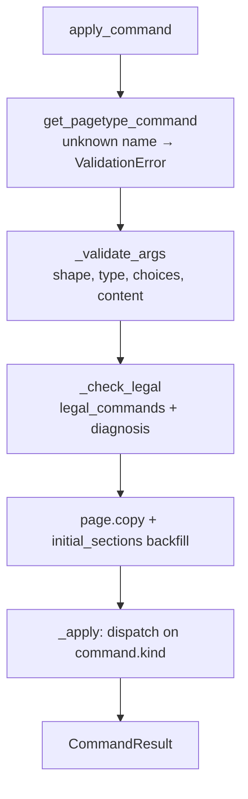

# Command & Mutation Engine

# Command & Mutation Engine

`src/commands.py` — the pure write path. `src/errors.py` — the failure vocabulary it raises.

Every mutation in pasta lands here. A tool call arrives at the server, the store resolves the workspace and page and runs the cross-page prechecks, and then hands a `Page`, its `PageType`, a command name and an args dict to this module. What comes back is a *new* `Page`. Nothing in this file touches disk, the clock, the registry state, or the input page.

## The contract

Three rules define the module, and any new code in it has to keep all three:

1. **Pure.** No I/O, no globals, no ambient time or randomness. Identifiers come in through an injected `IdFactory` (`Callable[[str], str]`) so tests can supply a deterministic counter instead of `ids.new_id`.
2. **Copy–edit–return.** `apply_command` calls `page.copy()` (a deep copy) and edits the copy. The caller's page is never mutated, so a failed command leaves nothing behind. This is the in-memory half of the storage pattern in `store.py`: the store copies, calls in here, and only then writes the result back into the workspace.
3. **Raise, don't return errors.** Every rejection is a `PastaError` subclass with a message written for the agent that will read it.

The one deliberate exception to "no ambient state" is `create_page`, which calls `guard_production_type` from the page-type registry — the test-mode guard has to fire even when a caller bypasses `get_page_type` and passes a resolved `PageType` straight in.

## Public surface

| Function | Role |
| --- | --- |
| `create_page(page_type, title, parent_id, id_factory)` | A fresh page in its FSM's initial status with `initial_sections(page_type)` |
| `apply_command(page, page_type, command_name, args, id_factory, batch_context=None)` | Validate → check legality → apply; returns `CommandResult` |
| `legal_commands(page, page_type, ignore_requirements=False)` | `{command_name: bool}` for the page's current state |
| `unmet_requirements(page, command)` | The `(section, field)` preconditions still unpopulated |
| `field_setter_edges(page, page_type, blocked_events=())` | The stage-relevant `do` edges for self-direction |
| `resolve_anchored_slot(ids, index, preceding_id, context, batch_context=None)` | The shared stale-read guard for anchored placement |
| `BatchContext(created_ids)` | Ids created earlier in the same batch |
| `CommandResult(page, created_id, created_ids)` | The new page plus what the command created |

Everything else is private and dispatch-internal.

## How `apply_command` works



The order matters. Argument validation runs before legality so a malformed call is reported as malformed rather than as illegal, and both run before the copy so an invalid command costs nothing.

The `initial_sections(page_type, working.sections)` call on the copy is a **backfill**, not an initialisation. `initial_sections` is idempotent: sections and fields already present are carried over untouched, and only ones the page type declares but the page lacks get their empty default (`""` for prose, `[]` for list/blocks, `None` for scalar). That is what lets a page created before a section was added to its page type accept a write into that section instead of `KeyError`-ing inside `_apply`.

### Argument validation

`_validate_args` rejects unknown keys, missing required args, and type mismatches against `_PYTHON_TYPE` (the JSON-ish `"string"`/`"integer"`/`"array"`/… names a `ArgSpec.type` uses). Because `bool` is a subclass of `int` in Python, integers and booleans are guarded explicitly in both directions — a `True` passed where an integer is declared gets its own message.

Content-shaped args go one level deeper: an arg whose `content` is `BLOCK_ARRAY` is handed to `validate_blocks` along with the `block_kinds` the field declares; any other `content` shape (`INLINE_RUNS`, `INLINE_RUN_LISTS`, `INLINE_RUN_GRID`, `TABLE_ALIGN`) goes to `validate_inline_content`. Both live in `pagetypes/core/validation.py`. By the time `_apply` runs, a block entry's `kind` is known to be one the field accepts.

## Legality: four independent gates

`legal_commands` is the single answer to "what can this page do right now", and it is also what `_check_legal` consults, what `describe.describe_mutations` reports, and what `store.next_actions` filters. A command is legal only when all four gates pass:

- **FSM topology** (`_topology_ok`) — for a status transition, `command.event` must be in `fsm.allowed_events(page_type.fsm, page.status)`. Content commands pass this gate unconditionally.
- **Status lock** (`_status_ok`) — `command.legal_in is None` (any status) or the current status is in it. For content commands this is the status-scoped authoring lock; for transitions `legal_in` names the *source* statuses of the edge, which is also where the page FSM table is derived from.
- **Required content** (`unmet_requirements` + `_is_populated`) — every `(section, field)` in `command.requires` must be populated. "Populated" means non-blank for a string, non-empty for a list/dict, non-null for a scalar.
- **Terminal-status authoring lock** — in a status listed in `fsm.terminal_states`, authoring is locked. Status transitions stay legal (so `reopen` still works), and a command can opt back in by *explicitly* naming that status in its `legal_in` (`_opts_into_terminal_status`) — which is how bookkeeping that outlives the work stays writable. `legal_in=None` does not opt in; silence means locked.

A note on the transition/authoring split: `_is_status_transition` is true only for a `TRANSITION` or `COMPOUND` that carries an `event`. An `ELEMENT_TRANSITION` fires a *list element's* own FSM, not the page's, so from the page's point of view it is an authoring command and is locked in a terminal status like any other.

`ignore_requirements=True` skips **only** the third gate. Doc generation uses it to enumerate a status's outgoing transitions on a content-less page; the other three gates still apply, and the flag is not exposed through the live `describeMutations` tool.

Cross-page rules — ref integrity, link validity, parent/child state guards — are deliberately *not* here. The store runs those (`_check_ref`, `_check_block_refs`, `_check_inline_refs`, `_check_guards`, `_check_link`) before calling in, and the pure core trusts that they ran.

### Error messages that name the fix

`_check_legal` distinguishes two failure modes rather than emitting one generic refusal. If the FSM allows the event but required fields are empty, the message lists exactly which `section.field` pairs to set. Otherwise it reports the wrong-status case and names the currently legal commands. Either way the raised `IllegalCommandError` carries `legal=` — the sorted list of what *is* possible — so a caller can recover without a second round-trip.

## Applying: dispatch by `command.kind`

`_apply` is a flat dispatch on `CommandSpec.kind`, returning `(created_id, created_ids)`.

| Kind | Effect |
| --- | --- |
| `SET_SCALAR`, `SET_PROSE` | Write `args[command.args[0].name]` into `sections[section][field]` |
| `ADD_ELEMENT` | `_add_element` — create an id'd element, seed its element-FSM status and block fields, place it |
| `SET_ELEMENT_FIELD` | `_set_element_field` — apply mapped args and `element_const` literals to the element named by `args[0]`, id preserved |
| `ELEMENT_TRANSITION` | `_element_transition` — fire the element FSM, then apply field writes |
| `ADD_BLOCK` | `_add_block` — create a run of blocks, append or insert contiguously |
| `REMOVE_ELEMENT`, `REMOVE_BLOCK` | `_remove_by_id` — one implementation, two kinds |
| `REORDER_ELEMENT`, `REORDER_BLOCK` | `_reorder_entry` — anchored move, one implementation, two kinds |
| `ADD_LINK` | Append `{"to": args["toId"], "role": args["role"].strip()}` to `page.links` |
| `SET_TITLE` | Rename in place; blank title raises the same message as `create_page` / `store.rename_page` |
| `TRANSITION` | `page.status = fsm.fire(page_type.fsm, page.status, command.event)` |
| `COMPOUND` | Recurse over `command.steps` against the same working page and args |

`COMPOUND` is where the two return values diverge in the aggregate: the last step's `created_id` wins as the positional report, while `created_ids` accumulates from every step. Adding a new kind means adding a constant in `pagetypes/core/specs.py`, a branch here, and a helper — the fall-through raises `ValidationError` for an unsupported kind, so a half-wired kind fails loudly.

Note what `_apply` never writes: `status_revision_token`. The store regenerates that stamp when it observes `working.status != status_before`. A page-type command has no business minting a concurrency token.

## Addressing conventions

Three small helpers encode the whole positional-argument convention, and they are the part most worth internalising before editing:

- **`args[0]` is the target id.** For element-scoped commands (`command.element_field` is set), `args[0]` is the *element* id and `args[1]` is the block id. `_entry_id` picks the right one.
- **`_target_entries`** resolves the list a command operates on: the section's own field, or — when element-scoped — the block array hanging off the element named by `args[0]`. It *creates* that array if the element doesn't carry it yet, which is what lets an element stored before the block field was declared accept its first block.
- **`_entry_context`** names that list for error messages: `steps.items`, or `steps.items[<elementId>].detail` when element-scoped. Every `NotFoundError`, range error and stale-read conflict routes through it, so an author can always tell which of the two ids was wrong.

`index` and `precedingId` are positional args, never entries in `element_map`, so they never leak into the stored element body.

## Anchored placement and stale reads

Ordered insertion and reordering share one guard: `resolve_anchored_slot`.

The caller supplies `index` — the slot the entry will occupy — and `precedingId`, the id that must *currently* sit immediately before that slot (`None` if and only if `index` is 0). One check does four jobs: it range-checks the index, rejects a drifted index, rejects a predecessor that has moved or vanished, and enforces that `precedingId` is supplied for any non-front slot and omitted for the front (since a null can only match index 0). A mismatch is a `ConflictError` telling the caller to re-read and retry, rather than a silent landing in the wrong place.

This replaced two earlier failure modes: a whole-list reorder could drop ids written by a concurrent edit, and an index-only move could land in a stale slot. `_reorder_entry` now names only the moved id, its `toIndex` (the resting index *after* the item is removed) and the `precedingId` that must precede it.

The guard is shared by three callers: `_resolve_slot` (which adapts it to a `list[dict]` by projecting ids) for positioned adds and block/element reorders, and `store.reorder_page` directly for page siblings.

### Batch-created ids

`BatchContext.created_ids` carries the ids created by earlier commands in the same `mutatePageBatch`. A caller cannot name an id that has not been committed yet, so `resolve_anchored_slot` walks left past any batch-created ids when computing the expected predecessor, anchoring on the first *committed* id instead. With no batch context (a single mutation) the check is strict.

The store feeds this loop: it accumulates `result.created_ids` into `created_so_far` and passes `BatchContext(frozenset(created_so_far))` into each subsequent `apply_command`. That is why `CommandResult` has both fields — a block add creates a whole run but reports only the first id positionally (one `createdId` per command), while the batch's anchored-slot guard needs all of them.

### Runs of blocks

`_place_entry` takes an `offset` so a run lands contiguously from one anchored slot. The guard resolves once, against the slot the run starts at; members after the first use `index + offset`. Without this, N positioned inserts would each re-resolve the same index and the run would come out reversed. `_reject_dangling_preceding` catches the other end of the same idea: `precedingId` anchors a positioned insert, so it is meaningless without an `index`.

## Blocks are built in exactly one place

`_create_blocks` is the only function that constructs a block dict: `{"id": id_factory(""), "kind": ..., **body_args}`. Three paths reach it — a page-level `ADD_BLOCK`, an element-scoped `ADD_BLOCK`, and `_element_blocks_from_args` for an element created holding its blocks — so a block is indistinguishable key for key whichever command made it. That invariant is directly tested (`test_a_block_created_with_its_element_matches_one_added_after`, `test_a_block_is_built_in_exactly_one_place`); route any new block-producing path through this helper.

Note the empty prefix: `id_factory("")` gives blocks and elements unprefixed ids, unlike pages, which get `id_factory(page_type.tag)`.

## Element FSMs

A `list` field may declare an `element_fsm` on its `FieldSpec`, giving its elements their own lifecycle independent of the page's. `_add_element` seeds `element["status"]` from that FSM's initial state; `_element_transition` reads the element's current status (defaulting to the initial state for an element created before the FSM was declared), fires the event through `fsm.fire`, and then applies field writes. Firing is what rejects an illegal mark — `fsm.fire` surfaces python-statemachine's `TransitionNotAllowed` as an `IllegalCommandError`. A field with no `element_fsm` raises `ValidationError` if a transition command targets it.

## `field_setter_edges` — the self-direction `do` list

This is the most subtle function in the module, and the one most likely to be misread as "list the legal setters". It answers a narrower question: *which fields is authoring right now what advances the current stage?*

A field's setter belongs in `do` only when both hold: its `(section, field)` is a `requires` precondition of a transition **topologically** legal from the current status, and the setter is legal right now. The derivation is generic from the FSM with no per-page-type knowledge, which is what stops a `legal_in=None` "always legal" setter from adding noise in a status where its field is not the goal.

`blocked_events` is the escape hatch for the outside world. The caller names events that cannot fire for a reason no authoring on *this* page can clear; those are dropped from the topology *before* requirements are collected. The store passes the page's **parent**-state-guard failures here, so a pinned plan child whose feature-brief is still `grounding` stays silent rather than advertising `addStep`/`addCase` while the base is still being established. **Child**-state guards are deliberately not passed — "my children are unfinished" does not make my own authoring premature.

Every entry has one shape, built by `_field_setter_edge`: `kind='field'` with the `(section, field)`, the field's `FieldSpec.description` as an inline `instruction`, the single `command` that writes it, and the page's `statusRevisionToken`. Inlining the instruction is the point — a `next` consumer needs no `describePageType` round-trip to know what to author.

One field, one edge, one command: a field's whole authoring content is reachable in a single command (a blocks field takes its blocks as an array; a list add carries the blocks its element is created holding). `is_field_setter` in `pagetypes/core/commands.py` is the classifier — `SET_SCALAR`, `SET_PROSE`, `ADD_ELEMENT`, and a *page-level* `ADD_BLOCK` only. Element-scoped block adds, removes, reorders, `SET_ELEMENT_FIELD`, `ELEMENT_TRANSITION`, transitions, `ADD_LINK` and `SET_TITLE` are not setters; `describeMutations` reports those. `PageType`'s post-init rejects a type declaring two setters for one field, which is why `setters.setdefault` can trust the first legal match it finds.

## Errors (`src/errors.py`)

```
PastaError                      base for every expected (non-bug) failure
├── NotFoundError               a workspace, page, or element id does not resolve
├── ValidationError             bad args: unknown, missing, wrong type, not an enum member
├── IllegalCommandError         not legal now; carries .legal = what is
├── ConflictError               a structural/consistency rule broke — cycle, stale-read anchor
└── ProductionTypeInTestError   a test touched a production page type in test mode
```

Raised by the pure core (`commands`, `fsm`, `serialize`) and by the storage shell (`store`); translated into FastMCP tool errors by the server. `ProductionTypeInTestError` comes from `guard_production_type` — production page types are off-limits to the test suite, which exercises capabilities on the hand-authored `test-*` fixtures in `src/testtypes.py`.

When the store aborts a batch it re-raises the *same* error class with a `Batch aborted at command <n> ('<name>')` prefix, so adding a new error type keeps its classification through the batch boundary. Keep new failure modes inside this hierarchy; anything outside it reads as a bug rather than a rejection.

## How it connects

**Declarations in, mutations out.** This module owns no knowledge of any particular page type. Everything it needs comes from `PageType` via `get_pagetype_command`, `get_pagetype_field` and `initial_sections`, and every legality question about statuses goes to `fsm.allowed_events` / `fsm.fire`. Adding a page type requires no change here; adding a *command kind* does.

Callers, and what each one wants from the module:

- **`store.create_page` / `store._create_auto_children`** → `create_page`. The store handles parent wiring, persistence, and the initial revision stamp.
- **`store.mutate_page_batch`** → `apply_command` per entry, with `BatchContext` threading created ids forward and a `statusRevisionToken` check per command. Cross-page prechecks run before each call; a `PastaError` anywhere aborts the whole batch and writes nothing.
- **`store.next_actions`** → `legal_commands`, `unmet_requirements`, and `field_setter_edges(page, page_type, parent_blocked)` to build the self-direction rollup.
- **`store.reorder_page`** → `resolve_anchored_slot` for page siblings, reusing the same stale-read guard as in-page reorders.
- **`describe.describe_mutations`** → `legal_commands`, for the live tool.
- **`docsgen.state_docs`** (via `describe_mutations`, driven by `scripts/gen_page_type_docs.py`) → `legal_commands` with `ignore_requirements=True`, to enumerate a status's outgoing transitions on a content-less page.

## Contributing notes

- **Adding a command kind:** constant in `pagetypes/core/specs.py` → branch in `_apply` → helper here. Decide explicitly whether it is a status transition (`_is_status_transition`) and whether it is a field setter (`is_field_setter`) — both classifications have downstream consequences for the terminal-status lock and the `do` list, and `PageType` post-init validation reads the latter.
- **Reuse the shared guards.** Any new ordered insertion goes through `_place_entry`/`resolve_anchored_slot`; any new block through `_create_blocks`; any error context through `_entry_context`. These are single-point-of-truth by design, and the tests assert it.
- **Don't add a cross-page check here.** If the rule needs to see another page, the workspace, or the filesystem, it belongs in the store's precheck layer. The purity of this module is what makes the write path testable without a workspace.
- **Tests:** `tests/test_commands.py` builds pages with the `test-*` fixtures via `create_page` + `apply_command`, and `tests/test_render.py` reuses the same path to construct render inputs. Run with `pytest --testmon`.