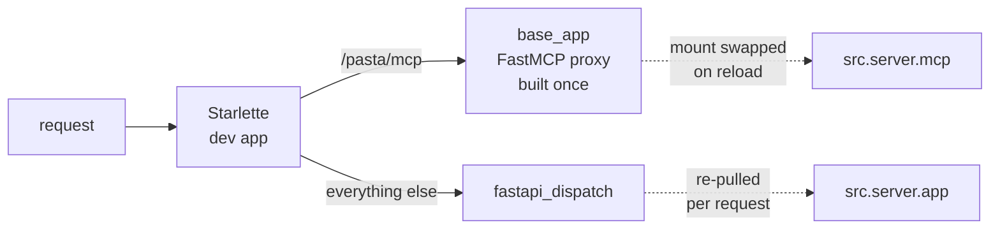

# Developer Tooling & Hot Reload

# Developer Tooling & Hot Reload

This module is the development-time scaffolding around the pasta server. None of it ships in the request path of a production deployment — it exists so that a developer editing `src/server.py` sees the result in a browser and in a connected MCP client *without* restarting anything, and so that when something does break there is a record to read afterwards.

Four concerns, four files:

| File | Concern |
| --- | --- |
| `src/hmr_server.py` | The dev server: one uvicorn process, in-process hot reload of both surfaces |
| `src/hmr_live_refresh.py` | Browser live-reload sockets, deliberately excluded from reloading |
| `src/_hmr_debug.py` | Capture reload-time errors that the reloader would otherwise swallow |
| `scripts/mcp_probe.py`, `scripts/feature_brief_probe.py`, `scripts/validate_workspace.py` | Manual probes and an offline integrity checker |

---

## The problem the dev server solves

`src.server` exposes two surfaces from one module: a FastMCP server (`src.server.mcp`) and a FastAPI app (`src.server.app`). Reloading by respawning the process — uvicorn's `--reload` — is cheap to set up and hostile to MCP: every respawn drops connected client sessions, and a client that has completed an `initialize` handshake has to redo it. An agent session mid-task does not survive that.

So `src/hmr_server.py` reloads *in process*. It merges two upstream patterns:

- **`uvicorn-hmr`** — serve a reloaded ASGI app and push a refresh to connected browsers.
- **`mcp-hmr`** — keep a stable outer proxy, swap what is mounted under it, and tell live sessions the tool list changed.

The result is a single uvicorn server, a single file watcher, and a single reactive context serving both surfaces.

### Reactivity, not respawn

The hot part comes from `hmr` (`reactivity.hmr`). Instantiating the `Reloader` installs an **import finder**, after which `src.server` and its submodules load as *reactive modules*: when a file changes, that module re-executes in place and the change propagates along the dependency graph to everything that read from it.

Two `@derived(context=HMR_CONTEXT)` functions are the handles onto the reloaded module:

```python
@derived(context=HMR_CONTEXT)
def current_mcp() -> FastMCP:
    return import_module(TARGET_MODULE).mcp

@derived(context=HMR_CONTEXT)
def current_fastapi():
    return import_module(TARGET_MODULE).app
```

Reading either one *inside a reactive computation* subscribes that computation to reloads of `src.server`. That subscription is the entire reload mechanism — there is no explicit "on file change, rebuild X" wiring for the app objects themselves.

> **The one rule that breaks everything:** `src.server` and `src.cleanup` must be imported **only** through the reloader's finder — via `import_module(...)` inside these functions, never at module top level. A top-level import resolves before the finder is installed, the module loads as an ordinary module, and hot reload silently degrades to a no-op. No error, just a dev server that stops noticing your edits.

### The outer app

`build_dev_app()` returns a stable Starlette app with two mounts:



The asymmetry is the point:

- **MCP** needs a *stable* object, because client sessions are attached to it. `base_app = FastMCP(name="pasta-hmr-proxy")` is built once and never rebuilt; its `http_app(path="/mcp")` is mounted at `/pasta`. Only the inner mount swaps.
- **FastAPI** needs no such care — browsers reconnect freely. `fastapi_dispatch` calls `current_fastapi()` on *every* request and forwards to whatever object comes back.

`fastapi_dispatch` also doubles as the reload detector for logging. `src.server` re-executing rebuilds `app` as a new object, so a changed identity *is* the reload signal:

```python
if last_fastapi_app is not None and fastapi_app is not last_fastapi_app:
    logger.info("[HMR] FastAPI app reloaded (src.server.app)")
```

The first request after startup is skipped — there is nothing to compare against yet.

---

## Swapping the MCP mount

This is the most intricate part of the module, and the part most likely to break on a dependency upgrade.

### Mount / unmount

`mount_mcp(mcp)` calls `base_app.mount(mcp)`, then grabs `base_app.providers[-1]` — each mount appends one `FastMCPProvider` — and returns a closure that removes exactly that provider. `base_app.providers` is a **fastmcp internal** (3.4.x at time of writing); it is how unmount is expressed because there is no public API for it.

Only one mount is live at a time. `serve_mcp` holds `mount_lock` for the lifetime of a mount and coordinates via two events:

```python
async def serve_mcp(mcp: FastMCP, stop: Event, finish: Event):
    async with mount_lock:
        unmount = mount_mcp(mcp)
        try:
            await notify_sessions()
            await stop.wait()
        finally:
            unmount()
            finish.set()
```

`mcp_reload_effect` is the reactive driver. It distinguishes the first mount from a reload by whether a previous `stop_event`/`finish_event` pair exists, tears the old mount down (`stop_event.set()`, then `await finish_event.wait()`) *before* reading `current_mcp()`, and spawns a fresh `serve_mcp` task on the lifespan's `TaskGroup`. Reading `current_mcp()` inside the effect is what subscribes it to the next reload.

### Keeping sessions alive across the swap

A swapped tool set is useless if clients never hear about it. To notify them, the module must hold references to live `ServerSession` objects — and MCP gives no registry. So it wraps the constructor, adapted from `mcp-hmr`:

```python
_active_sessions: WeakSet[ServerSession] = WeakSet()
```

`_patch_session_init()` replaces `ServerSession.__init__` with a `capture_init` that calls through to the original, adds `self` to the `WeakSet`, decrements a pending counter, and self-restores once nothing else is waiting for a capture. `base_app._mcp_server.run` is wrapped as `_run_with_session_capture` so the patch is armed exactly while the low-level server is running, and unpatched in a `finally`. A `WeakSet` means closed sessions drop out on their own.

`notify_sessions()` then fires all three list-changed notifications — `send_tool_list_changed`, `send_resource_list_changed`, `send_prompt_list_changed` — at every session, each wrapped in `suppress(Exception)` so one dead socket cannot abort the rest.

### The cleanup scheduler

`src.cleanup` runs the hourly workspace sweep, and a live background task must not be orphaned by a reload. `cleanup_reload_effect` handles this:

```python
@async_effect(context=HMR_CONTEXT, call_immediately=False)
async def cleanup_reload_effect():
    cleanup = import_module("src.cleanup")
    await cleanup.stop_scheduler()
    cleanup.start_scheduler(import_module(TARGET_MODULE).STORE)
```

The reason it *reads an attribute* rather than merely importing is subtle: `ReactiveModule.load` is lazy, so an import alone would not necessarily subscribe the effect. Touching an attribute does, which makes an edit to `src/cleanup.py` re-execute this effect promptly. By the time it runs, the module's `on_dispose` hook has already cancelled the old sweep; this starts the new one.

### Watching, and what is not watched

```python
class Reloader(AsyncReloader):
    def __init__(self):
        super().__init__(_PACKAGE_DIR, includes=[_PACKAGE_DIR], excludes=[_LIVE_REFRESH_FILE])
        self.error_filter.exclude_filenames.add(__file__)

    def on_changes(self, files):
        super().on_changes(files)
        with suppress(RuntimeError):
            asyncio.get_running_loop().create_task(ws_reloader.refresh())
```

`on_changes` orders the two halves deliberately: reload the modules first (reactive propagation, which swaps the MCP mount and rebuilds `app`), *then* refresh browsers — so a reloading browser fetches the new code, not the old. The `suppress(RuntimeError)` covers a change arriving with no running loop.

`src/hmr_live_refresh.py` is excluded from the reload set, for reasons below.

### Lifespan wiring

The outer app's lifespan is `combine_lifespans(mcp_asgi.lifespan, reloader_lifespan)`. The first starts the proxy's `StreamableHTTPSessionManager`; the second, `reloader_lifespan`, owns the reload machinery:

1. `call_pre_reload_hooks()`
2. Open a `TaskGroup`, publish it to the closure so effects can spawn tasks on it
3. Construct `Reloader()` — **this installs the import finder**
4. `await mcp_reload_effect()` — the first mount
5. `call_post_reload_hooks()`
6. Start `reloader.start_watching()` as a task
7. `await cleanup_reload_effect()` — start the sweep
8. `yield`
9. On teardown: dispose both effects, stop the scheduler, stop watching, set `stop_event` to release the live mount, cancel the watch task

Step 3 preceding any use of `current_mcp()`/`current_fastapi()` is what makes the target module load reactively.

`run_dev_server(host, port)` is the entry point — `uvicorn.run(build_dev_app(), ..., timeout_graceful_shutdown=1)` — and is called from `main.py`. It blocks until interrupted.

### Logging

Reload messages go through `logging.getLogger("uvicorn.error")`, not a module logger. uvicorn configures only its own loggers; a standalone logger at INFO would have its records dropped, and `[HMR]` lines would silently never appear.

---

## Browser live reload: `src/hmr_live_refresh.py`

`ReloaderConnectionManager` is small — `connect` accepts and appends, `disconnect` removes, `refresh` sends `{"refresh": 1}` to every socket and prunes the ones that raise. `ws_reloader` is the process-wide singleton.

Its *location* carries the design weight. It holds live browser WebSockets as in-process state (`ws_reloader.active`). If this module were in the reload set, every source change would re-execute it, replace the singleton, and drop the connection list — browser auto-refresh would quietly stop working while everything else looked fine. So `hmr_server.py` passes its path as `excludes`, and a single instance survives every reload.

That single instance has two classes of caller:

- the reactively-reloaded `src.server`, which serves the `/ws/reloader` route (`fastapi_reloader` → `connect`) and calls `refresh()` after every mutating operation — `createPage`, `mutatePageBatch`, `archivePage`, `renamePage`, `reparentPage`, `reorderPage`, `link`/`unlink`, `setWorkspaceGuidance`, the workspace archive tools, and the HTML routes `route_archive_page` / `route_set_page_status` / `route_unarchive_page`;
- the stable `src.hmr_server`, which calls `refresh()` on file change.

So the browser refreshes both when an agent mutates a page over MCP and when a developer edits a file — two triggers, one socket list.

Note that the `/ws/reloader` WebSocket is served by the *reloaded* FastAPI app through `fastapi_dispatch`, while the connections themselves live in the non-reloaded manager. That split is why a reload does not disconnect open browsers.

---

## Reload-error capture: `src/_hmr_debug.py`

The `hmr` reloader *prints* a module's re-exec traceback and then swallows it (`ErrorFilter` → `sys.excepthook`), and errors raised inside the async reload effect go to the event loop's exception handler. Either way a failed hot reload leaves nothing on disk — you get console output and no artifact a tool can read. This module tees all three sinks to `hmr_debug.log` in the repo root:

- **`sys.excepthook`** — where `ErrorFilter.__exit__` sends re-exec failures
- **`sys.unraisablehook`** — unraisable exceptions, logged with `args.err_msg`
- **the asyncio exception handler** — best effort; skipped entirely if there is no running loop at import time

`_log(header, text)` appends a timestamped `===== <iso-stamp> <header> =====` block; `_fmt` formats a traceback triple. Each installed hook chains to the original it replaced, so normal reporting is unaffected.

The whole module is **import-time side effect only, and idempotent**. Idempotence is achieved by stashing each original on `sys` under a private attribute (`sys._hmr_dbg_excepthook_orig`, `sys._hmr_dbg_unraisable_orig`) and installing only if absent, plus a `_loop._hmr_dbg_installed` flag for the loop handler. That matters because it is wired in by an import at the end of `server.py`, so it hot-loads with the server and gets re-imported on every reload — without the guards, each reload would stack another wrapper and eventually chain a hundred deep.

The final `_log("armed", ...)` writes a marker on every arm, which doubles as a reload heartbeat in the log.

The primary thing this makes diagnosable: the **load-ordering races a multi-file change can trigger**, where several modules re-execute and one briefly sees a half-updated dependency. Those surface as a printed traceback and then vanish; here they persist.

---

## Manual probes

These are deliberately *manual* — not tests. They print everything verbatim and are meant to be rerun at will while investigating a bug, with the failing step and *where* it failed obvious rather than swallowed. All require a server already running.

### `scripts/mcp_probe.py` — transport handshake

Walks the streamable-HTTP handshake against a pasta MCP endpoint: `initialize` → `notifications/initialized` → `tools/list` → `tools/call`. It exists largely because `initialize` is where a missing or unrun MCP lifespan surfaces — the `StreamableHTTPSessionManager task group was not initialized` error named in its docstring — and if `initialize` returns ≥400 the probe stops there rather than cascading meaningless failures.

Three helpers do the work, and are reused by the sibling probe:

- **`rpc(request_id, method, params)`** — builds a JSON-RPC message; pass `request_id=None` for a notification (no `id` field).
- **`parse_body(response)`** — streamable HTTP may answer with JSON *or* an SSE stream, so `BASE_HEADERS` accepts both and this decodes both: a dict/list for JSON, a list of decoded frames for `text/event-stream` (scraping `data:` lines), raw text if undecodable, `None` if empty.
- **`show(label, response)`** — prints status line, the interesting headers (`content-type`, `mcp-session-id`, `mcp-protocol-version`), and the decoded body; returns the body.

`run(url)` threads the session id from the `initialize` response header onto every subsequent request. The URL is a **positional** argument so you can aim it at candidate paths — the HMR proxy and the real server can end up at different mount points, exactly the kind of thing this probe is for:

```bash
uv run python scripts/mcp_probe.py                                  # DEFAULT_URL
uv run python scripts/mcp_probe.py http://localhost:8000/pasta/mcp/pasta
```

`just probe` runs the default.

### `scripts/feature_brief_probe.py` — workflow lifecycle

The sibling probe. Same transport plumbing (it imports `BASE_HEADERS`, `DEFAULT_URL`, `PROTOCOL_VERSION`, `parse_body`, `rpc` directly — running a script puts its own directory on `sys.path`), different target: where `mcp_probe` checks the transport handshake, this checks *the workflow the transport carries*.

`walk()` drives a real feature-brief through its whole lifecycle — draft → grounding → spec → planning → planReview → building → review — authoring the content each stage gates on. After every step it prints the `do` / `blocked` / `humanGates` / `attention` rollup for the brief's entire subtree, so you can see **which instructions the server hands an agent at which stage**.

What it is for is *confirming stage-scoping by eye*. Each pinned child is held by a `ParentStateGuard` on its finalize transition, and `next_actions` withholds the field setters of a parent-gated transition, so the children come online one stage at a time:

```
grounding  ->  the brief's four grounding setters, all three children silent
spec       ->  the feature-spec's setters (+ askQuestion); NO addStep/addCase
planning   ->  addStep (carrying the step's own detail blocks) and addCase
```

The closing summary tallies edge count per stage, so a regression shows up as a stage that got **noisy** — most usefully, an `addStep` appearing during `spec`.

Structure:

- **`class Probe`** — a connected session scoped to one workspace. `handshake()` initializes and carries the session id. `call(tool, **arguments)` is one `tools/call` round-trip returning the decoded payload, raising `ProbeError` on a JSON-RPC error, an `isError` result, or an undecodable body — it prefers `structuredContent`, falling back to JSON-parsing the first text block. `mutate(page_id, *commands)` reads the page's current `status_revision_token`, stamps it as the first entry in each command's args (the server requires it on each), runs the batch, and returns the created ids with nulls dropped.
- **`cmd(command, /, **args)`** — one `{command, args}` entry. `command` is **positional-only** on purpose: several page-type commands take an arg called `name` (`addComponent`) or `command`, which would otherwise collide with the parameter.
- **`_result_frame(body)` / `_text_content(result)`** — pick the JSON-RPC message out of a JSON body or the last meaningful frame of an SSE stream, and pull the first text block from a `tools/call` result.
- **`show(...)`** — prints one stage's rollup and returns its `do` edge count. `do` edges print as *shapes* — kind, page type, command, target field — with each instruction elided via `elide()` to `INSTRUCTION_WIDTH` (44) characters. The point is to see the edge set at a glance; raise the constant or pass `--instructions` for more. `ELLIPSIS` is ASCII `...` on purpose, since the Windows console is cp1252 and mangles `…`.
- **`find_features_toc(probe)`** — locates the workspace's `Features` toc page to file the brief under, returning `None` if there is none.

The walk **stops at `review`**: `ship` is a human gate and the probe never crosses one. It then archives the brief and its pinned subtree so repeated runs do not litter the workspace, and verifies it is gone from the default tree. On failure it prints the brief id and the exact `archivePage(...)` call to clean it up by hand, leaving the brief in place for inspection — the answer its own `addDecisions` block records.

```bash
uv run python scripts/feature_brief_probe.py
just brief-probe --keep                 # leave the brief for inspection
just brief-probe --new-workspace        # clean-slate run in a fresh workspace
just brief-probe --instructions         # 200 chars of each instruction
```

---

## Offline integrity check: `scripts/validate_workspace.py`

The odd one out: **no server, no lock, no `src` import**. It reads a workspace JSON document straight off disk and reports structural problems as a human fix-list keyed to line numbers. It never edits anything. Exit code is 0 when clean and 1 when any problem is found, so it works as a check (`just validate`).

```bash
uv run python scripts/validate_workspace.py [PATH]
```

### Why there is a hand-rolled line index

Findings need to point a developer at a *line*, and `json.loads` discards position information. So there are two passes over the same file:

- **`build_index(text)`** scans the raw text with regexes into a `PageIndex` per page (`key_line`, `parent_id_line`, ordered `child_lines`, ordered `link_lines`). It also returns `duplicate_keys` — duplicated page-id keys, which must be caught here because JSON parsing silently keeps only the last.
- **`json.loads(text)`** gives the semantic data that `validate` reasons over.

`_scan_block` dispatches per field into `_scan_string_array` (for `child_ids`) and `_scan_link_array` (for `links[].to`), both of which short-circuit on an inline `[]` and return the line after the closing `]`.

The regexes are indentation-sensitive — a page key at exactly 4 spaces, fields at 6, string elements at 8, link `to` at 10. **This is exact only for a file written by the store**, which serializes with `json.dumps(..., indent=2)`, one token per line. Hand-reformat the file and the line numbers stop meaning anything.

### What `validate` checks

It builds `listed_parents` from the tree structure (`root_page_ids` + `child_ids`), which drives rendering and is therefore treated as authoritative for where a page is filed. Then, in order:

1. **Duplicate page ids** — same key twice in `pages`.
2. **`child_ids` → existence**, plus duplicate child entries within one parent.
3. **Unique filing** — a page listed by more than one parent, or listed as a child while also appearing in `root_page_ids`.
4. **`parent_id` agreement** — each page's `parent_id` matches where it is actually filed (or `null` for a root). Skipped when filing is ambiguous, since which `parent_id` is "right" is undecidable until finding 3 is resolved.
5. **Reachability** — every page filed exactly once. A page filed nowhere is an orphan, and the finding says so with teeth: the hourly cleanup sweep stamps an unreachable page with an expiry five days out and deletes it once that passes, so re-file it before then.
6. **`root_page_ids` sanity** — entries exist and are genuinely parentless.
7. **Links → existence** — every `links[].to` resolves.
8. **Empty tocs** — a `toc` page with no non-archived children and no section content is flagged as removable. Emptiness is decided by `_has_section_content` / `_is_empty_value`, which treat `None`, whitespace-only strings, and empty containers as empty.

Each problem becomes a `Finding(line, title, detail)` whose `detail` is phrased as an instruction — *"Remove that child_ids entry"*, *"Set parent_id to null"* — because the audience is a human about to edit the file. `render_report` groups findings by title, sorts each group by line, and numbers them into a single fix-list. `main` also calls `sys.stdout.reconfigure(errors="replace")` up front so a non-ASCII page title cannot crash the report on a narrow console.

---

## Connections to the rest of the codebase

- **`main.py` → `run_dev_server`** is the only entry into the dev server. `just main` runs it.
- **`src.server`** is the reactive target: `hmr_server` reads its `mcp`, `app`, and `STORE` attributes only through `import_module`, and imports `_hmr_debug` at its own tail so error capture hot-loads with it.
- **`src.hmr_live_refresh`** is the shared, non-reloaded singleton — written to by `src.server` on every mutation and by `hmr_server.Reloader.on_changes` on every file change.
- **`src.cleanup`** is started and restarted by `cleanup_reload_effect`; `validate_workspace.py` documents the same sweep's five-day orphan grace period from the outside.
- **`justfile`** is the operator surface: `main`, `probe`, `brief-probe *ARGS`, `validate`, plus `dev` which runs `main` and `sphinx` in parallel.

## If you are changing this code

A few things to know before you edit:

- **Never import `src.server` or `src.cleanup` at module top level in `hmr_server.py`.** Hot reload becomes a silent no-op — the worst possible failure mode, because nothing reports it.
- **Never add `hmr_live_refresh.py` to the reload set.** Browser refresh stops working silently.
- **The fastmcp internals are a known liability.** `base_app.providers` / `FastMCPProvider` for mount and unmount, and `base_app._mcp_server.run` for session capture, have changed across fastmcp versions. Revisit both on any fastmcp upgrade; the pin is `fastmcp>=3.4.4`.
- **If a reload misbehaves, read `hmr_debug.log` first.** It is the only durable record of a failed re-exec, and the load-ordering races that multi-file edits trigger are visible nowhere else.
- **`Reloader.__init__` adds `hmr_server.py` itself to `error_filter.exclude_filenames`**, so the reloader's own frames stay out of reported tracebacks. Keep that in mind when a traceback looks suspiciously short.