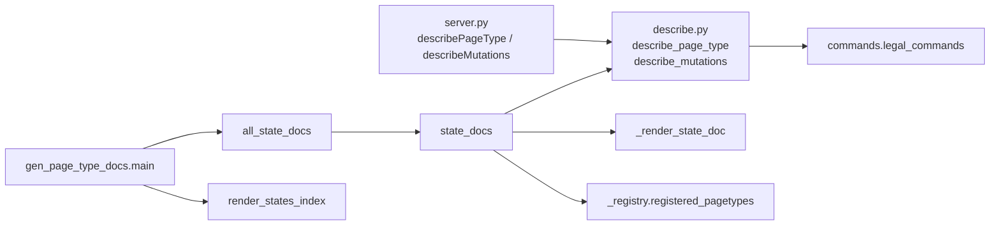

# Introspection & Documentation Generation

# Introspection & Documentation Generation

Two pure modules and one I/O driver turn the page-type registry into machine-readable schemas and a generated Sphinx reference:

| File | Role | Purity |
| --- | --- | --- |
| `src/describe.py` | Project a `PageType` (and a `Page`'s current legality) into JSON-shaped dicts | Pure |
| `src/docsgen.py` | Render those projections into one Markdown doc per page-type *state* | Pure |
| `scripts/gen_page_type_docs.py` | Write the rendered docs into `docsite/page-types/` | I/O only |
| `docsite/conf.py` | Sphinx config that makes the generated pages build | — |

`describe.py` has two consumers: the live MCP tools in `src/server.py`, and `docsgen.py`. Keeping one projection layer means the docsite and the tools an agent sees at runtime cannot drift apart — the docs are literally the tool output, rendered.



---

## `src/describe.py` — the projection layer

### `describe_page_type(page_type) -> dict`

The type-level schema, with no instance involved. Backs the `describePageType` MCP tool. Returns `tag`, `name`, `description`, `fsm` (via `describe_fsm`), `sections`, `workspaceGuidance`, and `commands` (each via `_command_summary`).

`describe_fsm` flattens `page_type.fsm` into `initial`, `states`, a list of `{event, source, dest, agency}` edges, and `statusGuidance`. The guidance is copied into a plain `dict` deliberately — `FSMSpec` itself must stay hashable, so it holds a hashable mapping; the projection has no such constraint.

The `sections` projection is where a caller learns a field's *vocabulary*. Since no command name encodes a block kind any more, `blockKinds` on a `BLOCKS` field (and `elementBlocks` on a list field whose elements hold blocks) is the only place that vocabulary is published. `elementFields` and `elementStates` describe list fields with per-element structure and per-element lifecycles.

Field-level `description` is the authoring instruction. It lives on the `FieldSpec`, **not** on the setter command — `_command_summary`'s comment says so explicitly, and `tests/test_describe.py::test_describe_page_type_keeps_the_instruction_on_the_field_not_the_setter` pins it. If you are tempted to duplicate an instruction onto a command, don't; the docs render it from the field.

### `describe_mutations(page, page_type, ignore_requirements=False) -> list[dict]`

The full command catalog for a *specific* page — every command the type declares, each with its arg schema and an `available` boolean. It calls `legal_commands(page, page_type, ignore_requirements=...)` and merges the result into `_command_summary` output. It is a full catalog, not a filtered one: illegal commands are still listed, just with `available: False`.

`ignore_requirements` is the one knob that separates the two consumers:

- The live `describeMutations` tool leaves it **False** — an agent should only see what it can actually fire.
- `docsgen` sets it **True** so a content-gated transition still enumerates on a content-less page. The `legal_in` status lock still applies, so a status-scoped command lock is documented truthfully even in this mode.

### `command_arg_schema(command) -> dict`

A JSON Schema `object` for one command's arguments. Two properties are structural:

1. **`statusRevisionToken` always comes first and is always required.** It's the optimistic-concurrency stamp; the store reads and strips it before the pure core sees the remaining arguments. Its description also carries the batching rule: a transition regenerates the token, so a batch holds at most one transition, and only as its final command.
2. **Block arguments expand.** When `arg.content == BLOCK_ARRAY` and `arg.block_kinds` is set, the property is replaced wholesale with `{"type": "array", "items": _block_schema(...)}`. `_block_schema` emits a `oneOf` branch per accepted kind, each with a `kind` const and the kind's declared `body_args` as properties. Those body args are the same source `validate_block` reads, so schema and grammar agree by construction.

`enum` (from `arg.choices`) and `description` are layered on after that replacement, so they apply to block-array args too.

### `_command_summary` and the `legalIn` suppression

One rule is easy to trip over: `legalIn` is emitted **only for non-transition commands**.

```python
"legalIn": (list(command.legal_in) if command.legal_in
            and command.kind not in (TRANSITION, COMPOUND) else None),
```

For a `TRANSITION`/`COMPOUND` command, `legal_in` is by definition the edge's source status, which the FSM transition list already reports. Repeating it would just clutter the describe output.

`requires` is projected as `[{"section": ..., "field": ...}]` — the content that must exist before a transition is legal. `docsgen` renders it as a "blocked until …" note.

---

## `src/docsgen.py` — rendering state pages

The unit of output is a **page-type-state**: one Markdown file per `(tag, state)` pair, stem `<tag>-<state>` (`_stem`). A state page is self-contained — it carries the state-specific parts *and* the whole type schema — so a reader landing on it never has to navigate elsewhere.

### Why the FSM walk is trivial

Two design facts make this module small, and both are load-bearing:

- **The `StateMachine` classes in `src.statecharts` are guardless.** Required-content preconditions and status-scoped locks live in `commands.py`, not in the machine. So the `statemachine-diagram` directive can replay any `:events:` path against a content-less machine, and a plain BFS over `FSMSpec.transitions` reaches every state.
- **`describe_mutations(..., ignore_requirements=True)`** lets a content-less seed page still enumerate content-gated transitions.

Break either one — add a guard to a machine, or start filtering requirements in the doc path — and state pages silently lose states or transitions.

### `reachable_states(fsm) -> dict[str, list[str]]`

Breadth-first from `fsm.initial`, mapping each reachable state to the **shortest** event sequence that reaches it (initial maps to `[]`). That sequence is exactly what goes into the diagram directive's `:events:` option, so shortest keeps the option short. `tests/test_docsgen.py::test_every_declared_state_is_reachable` asserts no declared state is orphaned.

### `_seed_page(page_type, state)`

A content-less `Page` pinned at `state`, with `sections=initial_sections(page_type)` and id `<tag>:doc`. It exists purely so `describe_mutations` has something to evaluate; nothing is persisted.

### `page_machine_qualname(tag)` and `_bindings_module()`

The diagram directive imports the machine class by dotted path, so `docsgen` has to name it. The convention: a machine is built under its `FSMSpec`'s own name and bound with a `Machine` suffix, so the path is `f"{module.__name__}.{page_type.fsm.name}Machine"`.

Both lookups raise `KeyError` rather than degrading:

- unknown `tag` in the registry;
- no attribute of that name on the bindings module.

That second check is the point — a page type whose binding was never added fails doc generation loudly instead of going silently undocumented.

`_bindings_module()` picks `src.testcharts` when `is_test_mode()` and `src.statecharts` otherwise, importing **inside the function** so the test fixtures never enter a live server's import graph. Keep that import local.

### Anatomy of a rendered state page

`_render_state_doc` assembles, in order:

| Part | Built by | Notes |
| --- | --- | --- |
| `# <tag> - <state>` heading | inline | |
| Intro paragraph | inline | The state's own `statusGuidance`, or a placeholder if it declares none |
| Diagram block | `_diagram_block` | ` ```{statemachine-diagram} <qualname}` with `:format: dot` and the BFS `:events:` path |
| All-states nav line | `_all_states_line` | Current state bolded, siblings linked |
| `## Transitions` | `_transitions_section` | Available commands whose `kind` is in `_PAGE_TRANSITION_KINDS` |
| `## Authoring commands` | `_authoring_section` | Everything else that's available |
| `## Page type schema` | `_page_type_section` | `describe_page_type` rendered in full: description, sections/fields, all commands |

The split uses `_PAGE_TRANSITION_KINDS = (TRANSITION, COMPOUND)`. `element_transition` is deliberately *not* in that tuple: it fires an element's own FSM, so from the page's point of view it is an authoring command.

`_transitions_section` resolves each command's destination through `event_dest`, a map built from the described FSM edges whose `source == state`. It indexes that map directly (`event_dest[command["event"]]`), which relies on `legal_commands` having already applied its topology check — a transition is only reported available when its source is the current status. If you loosen that check in `commands.py`, this lookup is where it will surface.

Terminal states and locked states render explicit sentences rather than empty sections (`"`<state>` is a terminal state - it has no outgoing transitions."`, `"No authoring commands are legal in `<state>`."`).

### The bullet formatter

`_bullet(marker, description, notes)` is shared by `_field_line`, `_command_line`, and `_authoring_section`, and it encodes one Markdown constraint worth knowing before you edit it:

- A **one-line** description stays inline after the marker, with `·`-joined notes trailing.
- A **multi-line** description (a wrapped field instruction) becomes an indented block computed from the marker's own indentation plus two spaces. Flush left, it would terminate the list item. In this branch the notes move up onto the marker line, next to the key they annotate.

Three tests pin exactly these three behaviours (`test_bullet_keeps_a_single_line_description_inline`, `test_bullet_indents_a_multiline_instruction_past_its_marker`, `test_bullet_keeps_notes_on_the_header_line`).

`_field_line` turns the field projection into notes: `choices`, `elementFields`, `elementStates`, `elementBlocks`, `blockKinds`. `_command_line` renders `name(sig)` via `_arg_signature` — a compact `name, optional?` list derived from the JSON Schema's `properties` and `required` — plus `requires` and `legalIn` notes.

### Public API

```python
state_docs(page_type)                    -> dict[str, str]   # one type, keyed <tag>-<state>
all_state_docs(registry=None)            -> dict[str, str]   # whole registry
render_states_index(registry=None)       -> str              # the states.md toctree
STATES_INDEX_STEM = "states"
```

`state_docs` captures `describe_page_type` **once** and `describe_mutations` **per state**; those two captures are the entire input to rendering. State ordering follows `fsm.states` declaration order (filtered to reachable) for readable navigation, not BFS order.

Both registry-wide functions default to `registered_pagetypes()` but accept an explicit registry — that parameter is what makes them testable against fixtures.

---

## `scripts/gen_page_type_docs.py` — the driver

```
uv run python scripts/gen_page_type_docs.py
```

It inserts the repo root on `sys.path` so `src` imports as a bare script, calls `all_state_docs()`, adds `render_states_index()` under `STATES_INDEX_STEM`, and writes each entry to `docsite/page-types/<stem>.md` with `newline="\n"`.

Behaviours to know:

- **Unchanged files are skipped.** It reads back an existing file and compares before writing; a missing file is the normal case on a clean checkout or after `just docs` wipes the directory.
- **It never deletes.** Drop a state from a page type and the stale `<tag>-<state>.md` stays until you remove it by hand.
- **It never touches hand-authored `page-types/<tag>.md` overviews.** Only `<tag>-<state>.md` files and `states.md` are generated.

Re-run after changing the page-type registry or any doc template in `docsgen.py`.

---

## Sphinx integration

`docsite/conf.py` puts the repo root on `sys.path` so the `statemachine-diagram` directive can import the machine classes that `page_machine_qualname` names. Extensions: `myst_parser` (the generated files are Markdown), `sphinxcontrib.mermaid`, `statemachine.contrib.diagram.sphinx_ext`, and `autodoc2` over `../src`.

`docsite/page-types.md` hand-links to the generated `page-types/states.md`, which in turn toctrees every state page — that chain is what keeps generated pages out of Sphinx's "document isn't in any toctree" warnings.

One inconsistency to be aware of: `docsgen._DIAGRAM_FORMAT` is `"dot"`, while the `conf.py` docstring describes the diagrams as Mermaid via `:format: mermaid`. The emitted directive is what actually runs; the docstring hasn't been updated. If you change `_DIAGRAM_FORMAT`, fix the docstring in the same change.

---

## Contributing

**Adding a field attribute.** Project it in `describe_page_type`'s field dict, then render it as a note in `_field_line`. Both halves are needed — a key added only to the projection appears in the MCP tool output but nowhere in the docs.

**Adding a command attribute.** Add it to `_command_summary`; if it belongs in the arg schema instead, put it in `command_arg_schema`. Then decide whether `_command_line` (type schema section) and/or `_transitions_section` / `_authoring_section` (state-specific sections) should surface it.

**Adding a page type.** Bind its machine as `<FSMSpecName>Machine` in `statecharts.py` (or `testcharts.py` for fixtures), or `page_machine_qualname` raises. Then re-run the driver.

**Adding a new command kind.** Decide whether it fires the page-status FSM. If it does, it belongs in `_PAGE_TRANSITION_KINDS`; if it fires something else (as `element_transition` does), leave it out so it renders as an authoring command.

**Testing.** `tests/test_describe.py` covers the projections (arg schema shape, revision-token ordering, block vocabulary, `ignore_requirements`, availability marking, terminal-state behaviour). `tests/test_docsgen.py` covers the walk and the renderers, including `test_all_state_docs_covers_every_reachable_state` and `test_all_state_docs_is_idempotent`. Everything in both modules is pure and returns strings or dicts, so unit tests need no filesystem — keep it that way and leave I/O in the driver.