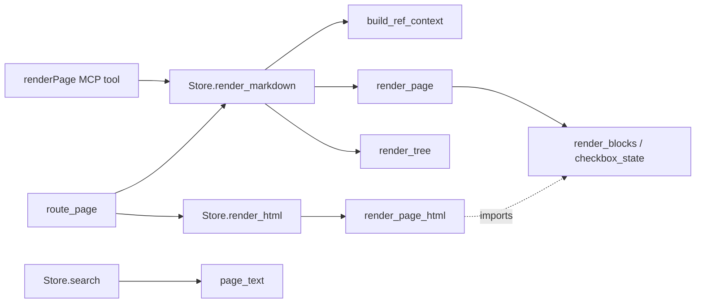

# Markdown Rendering

# Markdown Rendering — `src/render.py`

Pure rendering. Takes model objects (`Page`, `Workspace`) plus their page-type declarations and returns strings. No I/O, no store access, no registry lookups except one (`get_page_type`, used only while walking a tree). Everything the renderer needs about *other* pages arrives as an explicit `RefContext` argument, which is what keeps the module testable without a store.

It produces three distinct artifacts:

| Artifact | Entry point | Consumed by |
| --- | --- | --- |
| One page as Markdown | `render_page(page, page_type, level, ref_context)` | `Store.render_markdown` → `renderPage` MCP tool, and the web page route |
| A whole workspace as one Markdown document | `render_tree(workspace, show_archived)` | `Store.render_markdown` when `page_id is None` (MCP-only) |
| The nav tree as a nested Markdown link list | `render_workspace_links(tree, ...)` | `route_page` / `route_tree` in `src/server.py` |
| A flat text projection | `page_text(page, page_type)` | `Store.search` |

Two helpers are public because other renderers need to agree with this one: `render_blocks` and `checkbox_state` are imported by `src/render_html.py`, and `escape_markdown` is imported directly by `src/server.py` for the workspace index page.

---

## The two render paths

The same functions serve two callers with one behavioural difference, carried on `RefContext.escape_plain_text`:

- **MCP path** (`renderPage`) — Markdown is the deliverable. It is returned as authored, unescaped.
- **Web path** — the rendered Markdown is fed through a single top-level Markdown→HTML pass (`md2html.render`). That pass cannot distinguish the renderer's *deliberate* structural Markdown (headings, `-` bullets, `[x]` checkboxes, table pipes, links) from an author's field value that happens to contain `*` or `#`. So on this path every plain-text leaf is escaped **as it is emitted**, before it reaches the pass.

`Store.render_markdown(..., escape_plain_text=True)` is how the web route opts in; `Store.render_html` always passes `True`. The whole-tree render is MCP-only and therefore always unescaped.



### `escape_markdown`

Applied at each leaf via the tiny `_plain(text, ref_context)` gate — if there is no context, or the flag is off, the value passes through untouched. Three layers:

1. `_GLOBAL_ESCAPES` — backslash **first** (so the backslashes added by later rules are not themselves re-escaped), then `*`, `` ` ``, `_`, `[`, `]`.
2. `_BLOCK_LINE` — a zero-width multiline match on lines that *open* a block construct (`-`, `+ `, ATX `#`, `~~~`, `>`, a setext `=` underline) gets a leading backslash. Backtick fences and `*`/`_` thematic breaks are already handled by layer 1.
3. `_ORDERED_LINE` — for `N. `, the **dot** is escaped, not the digit: a backslash before a digit renders as a visible backslash.

Only plain text goes through it. Inline code spans (`{"code": ...}`), `href` targets, and page-route URLs are emitted raw — they are structure, not author prose.

---

## `RefContext`

A frozen snapshot of everything the renderer needs to know about *other* pages, built by `build_ref_context(workspace, show_archived, escape_plain_text)`:

- `titles` / `types` / `statuses` — every page id in the workspace, **archived included**, so an archived target can still be labelled rather than dropped to a bare id.
- `archived_ids` — the subset that is archived, letting child and reference lists hide or flag them.
- `workspace_id` — the link prefix: `/<workspace_id>/page/<id>`.
- `show_archived` — appends `?archived=true` to every emitted link so following one keeps the archived view.
- `escape_plain_text` — the render-mode flag described above.

`ref_context` is optional everywhere. Omit it (a direct render with no workspace) and refs, child pages, and reference targets degrade gracefully to their bare ids. This is the shape the unit tests use.

---

## Page anatomy — `render_page`

```
# <title>

*<type>* · `<status>` [· rev `<status_revision_token>`]

## <Section name>

<field>…

## References
## Child pages
```

`level` controls the title depth; sections sit one level below (`level + 1`). The revision segment appears only when `page.status_revision_token is not None`.

Every declared section and every declared field is emitted, whether or not it holds content — an empty one renders the italic `_NONE` fallback (`*None.*`). That is deliberate: a page's *shape* should be visible before it is filled, so an author can see what there is to write.

### The `toc` exception

A page type tagged `toc` renders as title, meta line, and a bare child list — no `References` or `Child pages` headings. A toc has no authoring commands, hence no `addLink`, hence its References list can never be non-empty; and its child list *is* the table of contents, so a heading above it is noise.

### Field rendering — `_field_content`

Dispatches on `FieldSpec.kind` (`SCALAR`, `PROSE`, `LIST`, `BLOCKS` from `pagetypes/core/specs.py`):

- **`SCALAR`** keeps its `- **key:** value` label even when empty, so the field stays *named*. It is the only kind that does.
- **`PROSE`** renders bare — the section heading names it.
- **`LIST`** → `_render_list`.
- **`BLOCKS`** → `render_blocks`.

Anything else falls through to `*None.*`.

### Lists — `_render_list`

One bullet per element:

```
- [x] <text>; <key>: <value>; … _[status]_
```

- `id` is dropped, `None` values are dropped, and any field named in `block_element_fields(field_spec)` is *withheld* from the flattened body — block-bearing fields render as indented Markdown **below** the bullet instead.
- `text` leads; remaining fields become `key: value` pairs joined with `; `. `bodysep` only appears when both sides are non-empty.
- `status`, when present, is echoed as a trailing `_[status]_` *in addition to* any checkbox.
- Block fields are rendered with `render_blocks` and passed through `_indent_list_content`, which prefixes two spaces to every non-blank line. Without that indent a fenced code block or nested list would terminate the list item. Blank lines are left genuinely blank — the repo trims trailing whitespace, so emitting `"  "` would churn.

### Checkboxes — `checkbox_state` / `_checkbox`

`checkbox_state(status, element_fsm)` is the single authority, returning `"done"`, `"todo"`, or `None`:

- `"done"` when `status == element_fsm.checkmark_done`
- `"todo"` when `status == element_fsm.initial`
- `None` otherwise — any intermediate state, an `ElementFSMSpec` with no `checkmark_done`, or a list field with no element FSM at all

It is public so `render_html.element_view` can ask the same question and spell the answer its own way (an HTML checkbox rather than `[x] `). `_checkbox` is this module's spelling: `"[x] "`, `"[ ] "`, or `""`.

---

## Blocks and inline runs

`render_blocks(blocks, ref_context)` walks an ordered array of typed block dicts and joins the results with a blank line, returning `None` for an empty list (so `_field_content` can substitute `*None.*`). Supported `kind` values: `heading` (level clamped to 1–6), `paragraph`, `code`, `list` (ordered or not), `quote`, `table`, `divider`, `decision`. An unrecognised kind falls back to `str(block)` — visibly wrong rather than silently dropped.

Text inside a block comes from `_inline_or_text`: rich `inlines` runs when present, otherwise the bounded plain-text `text` key.

`_render_run` handles the four run shapes declared in `specs.py`:

| Shape | Renders as |
| --- | --- |
| `"literal string"` | escaped plain text |
| `{"code": s}` | `` `s` `` (never escaped) |
| `{"ref": pageId}` | `[<target title>](/<ws>/page/<id>[?archived=true])`, or the **bare id** when there is no context or the id resolves to nothing |
| `{"text", "bold"?, "italic"?, "href"?}` | italic inside bold inside link — applied in that order |

Tables (`_render_table`) emit a header row, a separator row built from `_ALIGN_SEP` (`:---` / `:---:` / `---:` / `---`, defaulting to `---` for an unknown value), then the body rows; every cell is an inline-run array.

---

## Child pages and references

Both lists render the same link form — `[title](/ws/page/id) *type* · ` status ` ` — and both honour archiving the way the tree render does: an archived target is **hidden** unless `ref_context.show_archived`, in which case it is listed with a bold `**(A)** ` marker prefixed *before* the link.

Two details worth knowing before you touch either function:

- `_render_child_pages` sorts children by `_is_archived` before emitting. `sorted` is stable and `False < True`, so archived children sink below active ones with each group's relative order preserved — matching how `Store.tree` orders every level.
- The skip condition differs between the two. A child is skipped only when `archived and not page.archived and not show_archived` — an archived page still lists its own archived children, since hiding them would leave an archived page looking childless. `_render_references` has no such carve-out; an archived link target is hidden whenever `show_archived` is off.

`_render_references` reads `page.links` (outgoing typed edges, `{"to", "role"}`) and appends ` - <role>` to each line.

---

## Whole-tree render — `render_tree`

Emits `# <workspace name>`, builds one `RefContext` up front, then depth-first walks `workspace.root_page_ids`. An archived page returns immediately, pruning its whole subtree; a page whose type is not registered is skipped (its children are still walked). Heading depth is `min(depth, 6)`, starting at 2 for roots.

`show_archived` here does **not** widen which pages render — archived subtrees are always skipped. It only rides onto the inline-ref links so that following a ref out of the tree keeps the archived view.

---

## Nav tree — `render_workspace_links`

The odd one out: it takes a `store.tree()` **dict**, not model objects, and does its own escaping (calling `escape_markdown` directly rather than through `_plain`, since there is no `RefContext` in play). It recurses over `nodes` / `children`, indenting two spaces per depth level, and is used twice by the server with different flags:

- `show_meta=True` (the tree route) appends ` *type* · ` status ` ` to every line.
- `show_meta=False` (the page-route sidebar) instead appends the status in parentheses to the link *text* — but only for the types in `_STATUS_SUFFIX_TYPES` (`feature-brief`, `simple-change`, `bug-report`). Those are the pages a user tracks through a lifecycle; structural pages like `toc` or `architecture` have a status that is not worth the glance.

Archived nodes get the same `**(A)** ` prefix, and `show_archived` adds `?archived=true` to every link.

---

## Search projection — `page_text`

A flat, space-joined string of everything searchable on a page: the title, then every string value under every declared field. It deliberately does *not* reuse the Markdown renderer — search wants words, not structure.

The nesting it has to reach through is the subtle part:

1. Scalar and prose values are strings — taken directly.
2. A list element's fields are taken as strings, minus `id`.
3. For a `BLOCKS` field, each entry is a block whose rich text lives inside inline runs, not as top-level strings — `_block_inline_text` pulls it out of `inlines`, `items`, `paragraphs`, `header`, and `rows`.
4. A list element's *block fields* (from `block_element_fields`) nest one level deeper again: each block contributes both its top-level strings and its own inline text.

`_runs_text` skips `{"ref": id}` runs — a ref carries an opaque page id, not words a user would search for. Its title is already indexed on the target page.

---

## Contributing notes

- **Keep it pure.** No store, no filesystem, no request context. If a renderer needs to know something about another page, it belongs on `RefContext`, not fetched here.
- **Escape at the leaf, not at the end.** Escaping the finished document would destroy the structure this module just built. Any new author-provided text must go out through `_plain`; anything you emit yourself must not.
- **Answer questions once.** `checkbox_state` and `render_blocks` exist as public functions so the HTML renderer agrees with the Markdown one by construction. If you add a rendering decision both paths need, follow that shape rather than duplicating the logic in `render_html.py`.
- **Empty must render.** `*None.*` is a feature. A new field kind that renders nothing for an empty value breaks the "shape is visible before it is filled" contract.
- **Tests** live in `tests/test_render.py` and mostly drive `render_page` end-to-end against a small in-test page type, asserting on the Markdown string. `escape_markdown` and `checkbox_state` have direct unit tests. Run with `pytest --testmon`.