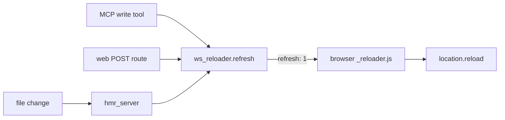

# MCP Server & Web Interface

# MCP Server & Web Interface

`src/server.py` is pasta's single entry surface. It builds one FastAPI application that serves two audiences from the same process and the same `Store`:

- **agents**, over MCP at `/pasta/mcp` (streamable HTTP) or over stdio,
- **humans**, over HTML at `/`, `/ws:<id>`, and `/ws:<id>/page/<pageId>`.

Everything below the surface — page types, the FSM, mutation validation, persistence — lives elsewhere. This module is a thin, uniform adapter: it unwraps route/tool arguments, delegates to `Store`, fires a browser refresh on every write, and translates errors into the shape each audience expects.

## Module map

| File | Responsibility |
| --- | --- |
| `main.py` | CLI entrypoint: `--stdio` runs `mcp.run(transport="stdio")`, otherwise `run_dev_server()` from `src/hmr_server.py` |
| `src/server.py` | The FastAPI app, the MCP tool surface, the websocket reloader route, error handling |
| `src/render_html.py` | Structured HTML render of one page (the web-only second render path) |
| `src/templates/` | Jinja2 templates + the three inline scripts (`_reloader.js`, `_theme.js`, `_view_toggle.js`) |
| `src/static/` | `styles.css` (water.css overrides + `.pasta-page` rules) and the vendored water.css themes |

## Application assembly

Import of `src/server.py` is not side-effect free, deliberately:

```python
validate_registry()                       # fail fast: every page type checked once, at load
DATA_DIR = os.environ.get("PASTA_DATA_DIR", ".pasta-data")
STORE = Store(DATA_DIR)
```

`validate_registry()` runs on a cold start **and on every HMR reload** (the module re-executes then), so a misconfigured page type surfaces all of its errors at once rather than piecemeal on a later request.

The app is then composed from two lifespans and three mounts:

```python
mcp: FastMCP = FastMCP("pasta")
mcp_app = mcp.http_app(path="/mcp")
app = FastAPI(lifespan=combine_lifespans(app_lifespan, mcp_app.lifespan))
app.mount("/static", StaticFiles(directory="src/static"))
app.mount("/sphinx", StaticFiles(directory="docsite/_build/html"))
app.mount("/pasta", mcp_app)              # MCP endpoint at /pasta/mcp
```

`app_lifespan` starts and stops the hourly cleanup scheduler (`cleanup.start_scheduler(STORE)` / `cleanup.stop_scheduler()`). **It only fires under plain ASGI hosting** — under the HMR dev server the app is served through a reactive dispatcher, and `hmr_server.reloader_lifespan` owns the scheduler instead (`start_scheduler` is idempotent, so both call sites are safe).

`mcp_app.lifespan` must be combined in; FastMCP's HTTP transport does not work without it.

### No HTTP caching

One `@app.middleware("http")` stamps `Cache-Control: no-cache, no-store, must-revalidate` on every response whose path does not end in `.css`. The server is only ever hosted locally, so caching buys nothing and was serving stale images. Middleware — rather than per-route headers — is what reaches the `/static` and `/sphinx` `StaticFiles` mounts where images live. `BaseHTTPMiddleware` only sees HTTP scopes, so the `/ws/reloader` websocket passes through untouched.

## The two guards

Every route and every tool body runs inside exactly one of two context managers. This is the module's core convention — a new route or tool should not invent a third error path.

```python
@contextmanager
def _guard_http():     # any Exception -> InternalError(traceback) -> error.html, HTTP 500
@contextmanager
def _guard_tool():     # PastaError   -> ToolError(str(exc))      -> client-visible message
```

`_guard_tool` catches only `PastaError` — the domain's *expected* rejections (unknown workspace, illegal transition, stale revision token, archived page). Those become `ToolError`, which the MCP client sees as a readable failure it can act on. Anything else propagates as a genuine server error.

`_guard_http` catches everything, wraps the `TracebackException`, and re-raises `InternalError`. The registered `@app.exception_handler(InternalError)` renders `error.html` with the formatted exception and full chained traceback at status 500 — and because `error.html` extends `_base.html`, the page still carries the reloader script, so a fix plus an HMR reload refreshes the error page back into a working one.

A handful of tools also raise `ToolError` directly for argument-level problems the store never sees (`describePageType` on an unknown type name, `describeMutations` on a page whose stored type is unregistered).

## MCP tool surface

Tools are declared with `@mcp.tool`; the function name *is* the tool name, so the camelCase naming is load-bearing. They fall into five groups.

**Bootstrapping.** `instructions()` returns the long prose contract that teaches an agent how to use pasta: find a workspace, describe page types, create a page before exploring code, read the echoed `next` after every write, stop at human gates. It is the only tool that returns a static string rather than touching the store.

**Reads** — `listWorkspaces`, `tree`, `getPage`, `outline`, `renderPage`, `search`, `nextActions`, `attention`, `describePageType`, `describeMutations`. These delegate straight to `STORE` (or to `describe.py` for the two `describe*` tools) and never fire a refresh.

**Writes** — `createWorkspace`, `createPage`, `mutatePageBatch`, `setWorkspaceGuidance`.

**Archiving** — `archiveWorkspace`, `unarchiveWorkspace`, `archivePage`, `unarchivePage`.

**Structure and graph** — `reparentPage`, `reorderPage`, `renamePage`, `link`, `unlink`.

Every write-shaped tool follows the same three beats:

```python
with _guard_tool():
    page, created = STORE.mutate_page_batch(workspaceId, pageId, commands)
    next_actions = STORE.next_actions(workspaceId, pageId)   # self-direction
    await ws_reloader.refresh()                              # browsers reload
    return {"pageId": ..., "status": ..., "statusRevisionToken": ..., "next": next_actions}
```

The `next` echo is what makes the wiki self-directing: `createPage` and `mutatePageBatch` re-read `STORE.next_actions` after committing and return it inline, so an agent never has to poll `nextActions` to learn what to author next. `mutatePageBatch` also echoes the regenerated `statusRevisionToken` — a status transition invalidates the old one, which is why at most one transition is legal per batch and only as its final command.

`getPage` and `renderPage` can exceed the MCP response limit; large results are persisted to a temp JSON file on disk rather than inlined (handled downstream in the store/serialization layer, but documented on the tool so callers expect it).

## Web routes

Four GETs and three POSTs, all guarded by `_guard_http`.

| Route | Renders |
| --- | --- |
| `GET /` | `index.html` — workspace list as Markdown links, through `md2html` |
| `GET /ws:{workspaceIdPart}` | `tree.html` — `STORE.tree()` through `render_workspace_links` |
| `GET /ws:{workspaceIdPart}/page/{pageId}` | `page.html` — sidebar nav + `STORE.render_html()` |
| `POST .../page/{pageId}/archive` \| `/unarchive` | archive toggle, then `ws_reloader.refresh()`, 202 |
| `POST .../page/{pageId}/status` | direct status override (`status` form field), then refresh, 202 |

Note the path shape: the workspace id is split so that the literal `ws:` prefix stays in the URL (`/ws:mrteq0c5-238cf6`), and each handler reassembles `workspace_id = f"ws:{workspaceIdPart}"`. Generated links elsewhere (`_page_link` in `render_html.py`) emit `/{workspace_id}/page/{page_id}`, which matches.

`?archived=true` is the single view flag, threaded through `show_archived` into the tree, the nav, and the render context. `?markdown=true` on the page route swaps the structured HTML body for the Markdown render run through `md2html`, which is how you eyeball what the `renderPage` MCP tool would return.

The page route also feeds `page.html` the controls at the bottom: `page_type.fsm.states` for the status dropdown (with the current one preselected), `page.archived` for the Archive/Unarchive button label, and `page_type_doc = f"{page.type}-{page.status}"` for the Model overlay's iframe target under `/sphinx/page-types/`.

### The POST routes are deliberate asymmetries

`archive`/`unarchive` mirror the `archivePage`/`unarchivePage` MCP tools because a browser cannot call MCP. The `status` route has **no** MCP equivalent: it is an admin override that bypasses the FSM entirely, letting a human force any state the type declares. Both kinds fire `ws_reloader.refresh()` exactly as the tools do.

## Live reload



`ws_reloader` is a process-wide `ReloaderConnectionManager` singleton living in `src/hmr_live_refresh.py`, **excluded from the hot-reload set on purpose**: it holds live `WebSocket` objects in `self.active`, and re-executing the module on every source change would drop them and silently kill auto-refresh. Both the reactively-reloaded `src.server` and the stable `src.hmr_server` import that one instance.

The route itself is a keepalive loop:

```python
@app.websocket("/ws/reloader")
async def fastapi_reloader(websocket: WebSocket):
    await ws_reloader.connect(websocket)
    # background task sends {"refresh": 0} every 5s; inbound frames are discarded
```

`{"refresh": 0}` is a no-op heartbeat; `{"refresh": 1}` (sent by `ws_reloader.refresh()`) tells the client to reload. `_reloader.js` closes the socket with code 1000 before reloading, saves `window.scrollY` into `sessionStorage` on `beforeunload`, restores it on `DOMContentLoaded`, and auto-reconnects one second after any close — so a dev-server restart reconnects without a manual refresh. The `window.__ws_reloader_loaded` guard keeps the inlined script idempotent.

The visibilitychange handler is intentionally inert: reloading on tab focus breaks when the server is offline (the page reloads into nothing). The comment in `_reloader.js` records the intended fix — a server-side timestamp carried on `{refresh: <ts>}` and compared against the page's load-time stamp.

## Structured HTML rendering (`src/render_html.py`)

A second render path exists **by design**. The Markdown renderer (`src/render.py`) is a returned contract — it is what `renderPage` gives an agent — and stays as it is. The HTML path exists because a list element carrying several fields reads badly as one flattened bullet; here each element becomes its own titled card with labelled rows.

`render_page_html(page, page_type, ref_context)` is the only public entry besides `element_view`. It is pure: model objects in, an HTML string out. `Store.render_html()` is what wires it up — it loads the workspace, resolves the page type, builds a `RefContext` via `render.build_ref_context(workspace, show_archived, escape_plain_text=True)`, and calls it.

Structure of the output:

1. `<header>` with title, `type · status`, and the `statusRevisionToken` as `rev …` (so the token a batch needs is readable off the page).
2. `_contents_html` — a link strip over every section plus `References` and `Child pages`, each carrying its element count.
3. One `_section_html` per declared section, one `_field_html` per field.
4. `References` (outgoing typed links with their role) and `Child pages`.

A `toc` page short-circuits: header plus `_children_html` only, because its child list *is* the table of contents.

### Field dispatch

`_field_html` branches on `field_spec.kind`:

- `SCALAR` — a single `<dt>/<dd>` row, keeping its label even when unset; a field keyed `url` becomes a `_url_link`.
- `PROSE` — `_text_html`: blank lines split paragraphs, single newlines collapse to spaces (matching how a Markdown reflow reads).
- `LIST` — `_list_html` → `element_view` → `_element_html`.
- `BLOCKS` — back onto the Markdown pipeline: `render_blocks(value, ref_context)` then `md2html.render(...)`, applied to this one field's fragment rather than the whole document.

Empty fields render `_NONE_HTML` (`<p class="empty">None.</p>`) rather than vanishing, so a page's shape is visible before it is filled.

### `element_view` — the one home of the element display rules

`element_view(element, index, field_spec) -> ElementView` decomposes a stored element *before any HTML exists*, which is why it is the most heavily tested function in the file. Its rules:

- The heading comes from `title_element_field(field_spec)` — the field the **type** declares as the heading (`title` or `name`) — and from nothing else. A type declaring neither yields elements headed by their ordinal alone. An empty heading value still consumes the field, so the field never reappears as a row and an element's shape never moves with an author's edits.
- `block_element_fields(field_spec)` are pulled out into `block_rows` and rendered after the plain rows, through the Markdown pipeline.
- Row order is declared-fields-first, then any stored key the type does *not* declare — nothing on the element is hidden. `id` is structural and `status` gets its own chip, so both are excluded.
- `checkbox_state(status, field_spec.element_fsm)` decides the ☑/☐ glyph; a field with no element FSM gets no checkbox.

`_element_html` then emits the ordinal as a link to `#element-<id>`, so a single item of a long list can be pointed at.

### Escaping and link resolution

Every author-provided leaf goes through `_escape` (`html.escape(..., quote=True)`) before reaching the output. `_url_link` escapes for both `href` and visible text and emits `target="_blank" rel="noopener noreferrer"`.

`_page_link(page_id, ref_context)` returns the titled `type · status` link for an id, or `None` when it resolves to no page. It resolves **on the value, not on a declared field kind** — a page id can reach a reader as ordinary text inside a list element field, and resolving by value means any such field reads as its target rather than as a bare id. An archived target is prefixed with `(A)` so a reader sees it is archived without following the link, and `show_archived` rides along as `?archived=true` so the archived view survives navigation. Without a `RefContext`, links degrade to escaped bare ids.

## Templates and client scripts

`_base.html` is the root: preloaded water.css light/dark sheets, `styles.css` overrides, an inlined `_reloader.js`, a theme radio form, and an inlined `_theme.js`. The body ships `display:none; visibility:hidden` and is revealed by `_theme.js` after it has applied the stored theme, which avoids a flash of the wrong sheet. `_theme.js` persists the choice in `localStorage`, swaps the `#js-stylesheet` href, mirrors the theme onto a body class, then removes the startup stylesheet.

`_nav.html` extends `_base.html` and adds the two-column layout (sidebar tree + main), plus the **Page | Model** toggle. `_view_toggle.js` lazily sets the iframe `src` from `data-src` on the first Model open — pointing at `/sphinx/page-types/{type}-{status}.html`, the Sphinx doc for this page's type *at its current status* — and overlays it on the rendered body. All three scripts use a `window.__*_loaded` guard, because HMR reloads re-inject them.

`page.html` extends `_nav.html` and adds `#page-actions`: the archive form and, when `statuses` is non-empty, the status override form. Both forms scroll to top on submit; both POST and get a 202 back.

Template contexts are passed with `request=request` as the first argument to `TemplateResponse` (the non-deprecated FastAPI signature), and rendered bodies are injected with `| safe` — which is sound only because `render_html.py` and `md2html` own the escaping upstream.

Styling for the structured render lives in `styles.css` scoped entirely under `.pasta-page`, so it cannot reach the sidebar, the workspace index, or the tree view. Every colour is a water.css custom property defined by both sheets, so the whole block follows the theme automatically.

## Running it

```bash
python main.py                    # HTTP on 0.0.0.0:8000 with hot module reload
python main.py --port 9000
python main.py --stdio            # MCP over stdio, no hot reload
```

The `--stdio` branch imports `src.server.mcp` directly — safe, because that path has no hot reload. The HTTP branch must **not** import `src.server` at top level; `src/hmr_server.py` imports it through the reactive finder so it becomes hot-reloadable. Importing it eagerly turns the hot reload into a silent no-op.

`PASTA_DATA_DIR` selects the store directory (default `.pasta-data`); it is read once at import, so changing it requires a restart rather than a reload.

The trailing `from . import _hmr_debug` at the bottom of `src/server.py` is import-for-side-effect: it captures HMR reload errors to `hmr_debug.log`. It sits last, and carries `# noqa: E402, F401`, so a failure inside it cannot prevent the app and tools from being defined.

## Adding to this module

**A new MCP tool.** Add an `async def` under `@mcp.tool` in the right section, wrap the body in `with _guard_tool():`, delegate to a `STORE` method, and — if it writes — `await ws_reloader.refresh()` and include `STORE.next_actions(...)` as `next` in the return value. The docstring is the tool description an agent reads, so it carries the contract (legality rules, rejection conditions, response shape), not just a label.

**A new web route.** Wrap in `with _guard_http():`, reassemble `workspace_id` from the `ws:`-prefixed path part, thread `archived` through as `show_archived`, and render through `templates.TemplateResponse`. A mutating route should mirror an MCP tool where one exists, fire the refresh, and return a 202 — the page reloads via the websocket rather than via the response body.

**A new field kind or element rule.** The display decision belongs in `element_view` (pure, cheap to unit-test) rather than in `_element_html`; the tests in `tests/test_render_html.py` exercise `element_view`, `_field_html`, `_list_html`, `_children_html`, and `render_page_html` directly, with and without a `RefContext`.