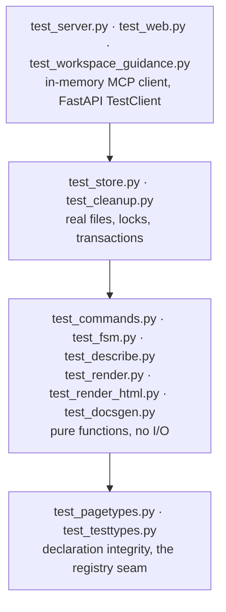

# Other

# `tests/` — the pasta test suite

The suite is one package: a single `conftest.py` that reconfigures the page-type registry for the whole process, plus seventeen test modules layered to match `src/`. There are no markers, no plugins beyond `pytest-testmon`, and no shared fixture library — each module builds what it needs from a handful of small local helpers that repeat, deliberately, across files.

Configuration lives in `pyproject.toml`:

```toml
[tool.pytest.ini_options]
pythonpath = ["."]
testpaths = ["tests"]
```

Run it with `uv run pytest`, or `uv run pytest --testmon` for red-green work (the project hint; `pytest-testmon` is in the dev group).

---

## Test mode: the one thing to understand first

`tests/conftest.py` calls `set_test_mode(True)` **at import**, before collection:

```python
from src.pagetypes._registry import set_test_mode

set_test_mode(True)
```

This is not a flag that gates lookups — it *empties* `_registry.REGISTRY` and puts the hand-authored fixtures from `src.testtypes` in its place. The consequences that shape every test in the suite:

- `get_page_type("test-fields")` resolves; `get_page_type("feature-brief")` raises `ProductionTypeInTestError`.
- `registered_pagetypes()` returns `TEST_REGISTRY`, so anything that enumerates the registry — the `describePageType` listing, doc generation in `src.docsgen` — sees only fixtures.
- Reaching past the accessor into `_registry.REGISTRY` finds `{}`, so a test cannot depend on a production type by reading the map directly either.
- `store.create_page(ws, "test-fields", ...)` works under test; the same call on a live server is a `ValidationError`.

The flag is set at import because test modules resolve their page types at module level (`FIELDS = get_page_type("test-fields")`). Nothing restores it — the flag lives for the process, and the process is the run.

A test that genuinely needs production asks for the `production_mode` fixture:

```python
@pytest.fixture
def production_mode():
    set_test_mode(False)
    yield
    set_test_mode(True)
```

It's used sparingly and always for the same reason: the assertion is *about* the production set. `test_docsgen.test_page_machine_qualname_resolves_for_every_production_type`, `test_fsm.test_every_production_page_type_holds_its_machine`, `test_statecharts` (both tests), and `test_pagetypes.test_production_types_are_exactly_the_registered_ones` are the whole list. `tests/test_testtypes.py` uses it most, because that file owns the seam itself.

## The fixture page types

`src.testtypes` supplies purpose-built capability fixtures — not clones of production types. The membership is pinned in `test_testtypes.TEST_TAGS`:

| Tag | Demonstrates |
| --- | --- |
| `test-fields` | scalar / enum / prose / list fields, `set_element_field`, anchored reorder |
| `test-blocks` | the full blocks vocabulary (all standard kinds), single-state FSM |
| `test-element-blocks` | block-bearing element fields (`snippet`, `detail`), element-scoped add/remove/reorder |
| `test-flow` | a 3-state status FSM, a compound `close`, a terminal state that keeps a transition |
| `test-lifecycle` | a rich lifecycle FSM, required-field preconditions, element-FSM questions, auto-children |
| `test-child` | step/check element FSMs, a `legal_in` content lock, a pinned child with a cross-page ref |

The payoff is stated in almost every module docstring: enriching a production page type never churns these assertions. When you add a capability, add it to the fixture that owns that axis — or, if none does, prefer extending an existing fixture over minting a seventh.

`test-flow` earns special mention: its event `open` and its state `open` share a name on purpose, so `src.fsm` has to keep the two namespaces distinct.

## Layering



Each tier assumes the one below is already covered and does not re-test it. Concretely:

- `test_commands.py` builds pages straight from `create_page` and never touches a `Store`. Its docstring on `addLink` is the rule in miniature: *the pure core appends the edge to `Page.links`; cross-page validation — existence, dedup — is the store's job.*
- `test_cleanup.py` builds `Workspace` objects from `src.model` by hand (`_ws` / `_p` helpers) because classification is pure. The store-backed transaction is covered once, in `test_store.py`.
- `test_store.py` exercises real files: persistence across a fresh `Store` over the same directory, atomic replace, and the readers-writer lock under contention.
- `test_server.py` and `test_web.py` drive the top layer end to end and assert wiring, not semantics.

## Shared idioms

### The deterministic id factory

Every module that calls into the pure core carries its own copy, named `make_counter` or `_counter`:

```python
def make_counter():
    state = {"n": 0}

    def factory(prefix: str) -> str:
        state["n"] += 1
        return f"{prefix}:{state['n']}" if prefix else f"el{state['n']}"

    return factory
```

Pages get `<prefix>:N`, elements and blocks get `elN`. Reuse one factory across a chain of `apply_command` calls in a single test so ids stay stable and orderings are assertable.

### Threading the revision token

`mutate_page_batch` requires each command to present the page's current `status_revision_token` inside its `args`. Three modules carry a near-identical `_mutate` wrapper that reads the token and stamps it on, because that is the ordinary caller pattern — read, then write against what you read:

```python
def _mutate(store, workspace_id, page_id, commands):
    token = store.get_page(workspace_id, page_id).status_revision_token
    stamped = [{**command, "args": {"statusRevisionToken": token, **(command.get("args") or {})}}
               for command in commands]
    return store.mutate_page_batch(workspace_id, page_id, stamped)
```

`test_server.py`'s version goes through `getPage` and reads the raw serialized `status_revision_token` key instead. A batch that transitions mid-sequence is *not* expressible through these helpers — a transition regenerates the token, so a later command's stamp is stale by construction. Tests covering that case present tokens explicitly (see the `status_revision_token` section at the tail of `test_store.py`, and the `revstore` fixture there that makes tokens a predictable `"000001"`, `"000002"`, … sequence).

### Repointing the module-global store

Both integration entry points resolve `server.STORE` at call time, so the fixture just reassigns it:

```python
@pytest.fixture
def mcp(tmp_path):
    server.STORE = Store(tmp_path)   # tools resolve STORE from the module at call time
    return server.mcp
```

`test_web.py` does the same and hands back a `TestClient(server.app)`. MCP calls go through `fastmcp.Client` against the in-memory server, wrapped in a local `call(mcp, name, args)` that runs the coroutine with `asyncio.run`.

### Ad-hoc, unregistered page types

Where no fixture covers the case — and adding one would be overreach — tests construct a `PageType` inline and never register it. These are conventionally tagged `xtest-*`:

```python
page_type = PageType(
    tag="xtest-terminal-optin", name="Opt-in", description="ad-hoc",
    sections=(SectionSpec("note", "Note", (_prose("body", ...),)), ...),
    commands=(set_prose_cmd("note", legal_in=("open",)), transition_cmd("finish", "open -> done")),
    fsm=FSMSpec(name="XOptIn", initial="open", states=("open", "done"), terminal_states=("done",)),
)
```

This is how `test_commands.py` reaches `field_setter_edges` blocks-grouping, how `test_fsm.py` proves a machine that cannot be built is *held as an error* rather than raised at construction, and how `test_pagetypes.py` feeds `validate_page_types` a type with two independent defects to confirm both surface in one raise. Each such helper carries a comment saying why a shared fixture wouldn't do.

### Parametrized structural invariants

`test_pagetypes.py` is the integrity harness. Its first ~370 lines are `@pytest.mark.parametrize("tag", list(ALL_TYPES))` invariants that must hold for *every* page type:

```python
PRODUCTION_TYPES = {page_type.tag: page_type for page_type in (
    _ARCHITECTURE, _DECISION_RECORD, _BUG_REPORT, _SIMPLE_CHANGE, _FEATURE_BRIEF, ...)}
ALL_TYPES = {**PRODUCTION_TYPES, **TEST_REGISTRY}
```

`PRODUCTION_TYPES` is written out by hand, importing each `_CONSTANT` from its module, precisely because test mode empties `REGISTRY` — the invariants must keep covering production regardless. `test_production_types_are_exactly_the_registered_ones` (under `production_mode`) is the guard that keeps that hand-written list honest; it is what fails when someone adds a page type and forgets the list.

The invariants themselves cover: FSM well-formedness, transition commands declaring a real source and a single destination per event, content commands targeting real `section.field` pairs, `requires` pointing at real fields, element transitions firing events their field's element FSM declares, block commands targeting `BLOCKS` fields (or a `LIST` field's declared block-bearing element field), and — the "extend to all fields" contract — every ordered field having its matching reorder command.

Below that divider the file switches to content-specific assertions pinned to the fixtures, then to the validator surface (`validate_page_type`, `validate_page_types`, `validate_registry`).

## Module notes

**`test_commands.py`** — the largest pure-core file. Organized by capability with `# ---` banners: create, scalar/enum, prose, list add/remove/set-element-field, argument validation, purity (`test_apply_command_does_not_mutate_input`), anchored reorder, then per-fixture sections for `test-flow`, `test-lifecycle`, `test-child`, and block-bearing element fields. `resolve_anchored_slot` gets its own direct tests — it is the shared guard behind block reorder, element reorder, and `store.reorder_page` — including the `BatchContext` case where ids created earlier in the same batch are opaque and the guard walks left past them.

**`test_fsm.py`** — pins that page types own their status machine: `PageType.__post_init__` builds it, a machine that can't be built (an unreachable state) is *kept* as `fsm.machine_error` rather than raised, and `sm_registry._REGISTRY[f"src.fsm.{name}"]` is the library's record that the build happened. Nothing in the production loops builds a machine, so finding one on every spec is the evidence that construction did it.

**`test_describe.py` / `test_docsgen.py`** — the read-only introspection and doc-generation surfaces. `test_docsgen` asserts registry-wide coverage (`all_state_docs` covers every reachable state of every registered type), idempotency, and that the `statemachine-diagram` directive paths resolve — against `src.testcharts` under test mode, `src.statecharts` under `production_mode`.

**`test_store.py`** — the largest file overall. Beyond CRUD and persistence it owns the page tree (reparent/reorder), the link graph, pinned auto-created children, the cleanup transaction, and the revision-token protocol. The concurrency tests are the load-bearing ones: 20 threads released together by a `threading.Barrier` must all land their `addItem` (no lost updates), a reader arriving mid-replace waits for the destination copy rather than reading the old file, and writer preference holds.

**`test_rwlock.py`** — pure threading, no I/O. Pins the exclusion rules `src.store` relies on: concurrent readers, writer excludes readers, a waiting writer blocks arriving readers, the write lock is reentrant for its owner and released only at the outermost exit, and `read()` inside `write()` does not deadlock. Uses `Event`/`Barrier` with short negative-wait timeouts (`assert not event.wait(timeout=0.2)`) to assert blocking.

**`test_serialize.py`** — round-trip plus a forward-compat pattern worth copying: for each field added since the format was first written (`links`, `expires_at`, `status_revision_token`), one test round-trips it and one deletes the key from a serialized dict to prove a legacy file still loads.

**`test_testtypes.py`** — owns the seam and nothing else. The fixtures' internal *shape* is asserted by whichever test exercises that capability; their structural well-formedness comes from `test_pagetypes`'s parametrized loop. This file only checks that the mode swaps the map, empties `REGISTRY` rather than merely gating it, restores it *in place* (so a reference taken before the switch is still live), and that resolution and the listing read that same one map.

## Adding tests

- **Pick the tier.** If the behaviour is pure, test it from `create_page` / `apply_command` without a `Store`. Only drop to `test_store.py` if files, locks, or cross-page validation are actually involved.
- **Use a fixture page type, and prefer an existing one.** `ProductionTypeInTestError` exists to steer you here. Reach for an ad-hoc `xtest-*` `PageType` only when the case is genuinely not a capability any fixture should own — and say so in a comment.
- **Extending a fixture is a registry change.** A new field or command on a `test-*` type must satisfy the parametrized invariants in `test_pagetypes.py`; the "every ordered field has a reorder command" rule in particular catches half-finished additions.
- **Adding a production page type** means updating `PRODUCTION_TYPES` in `test_pagetypes.py` and binding its status machine — `test_page_machine_qualname_resolves_for_every_production_type` is what fails when the binding is missed.
- **Write the comment that says why.** The suite's prevailing style is a one-line explanation of what would break without the assertion (`"returns; does not hang"`, `"the original untouched"`, `"a zero means unseen"`), rather than a restatement of the code.