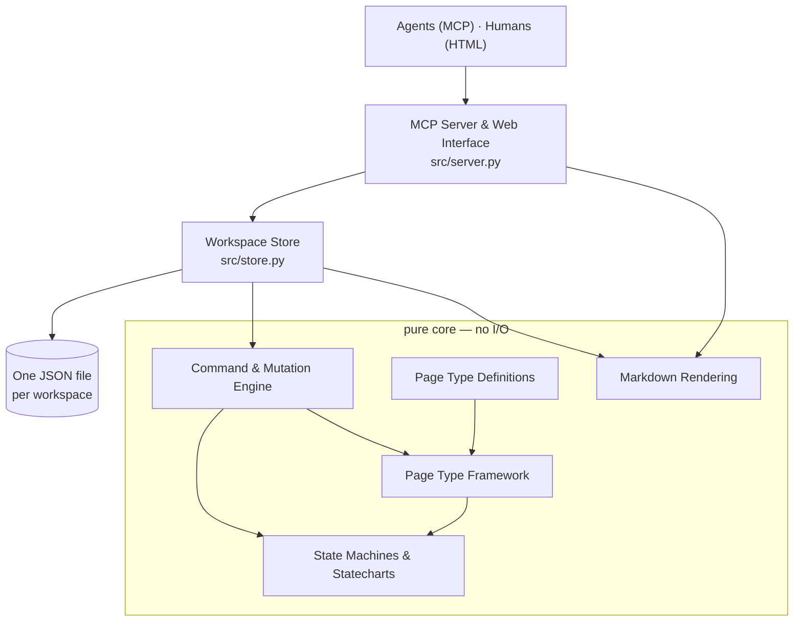

# pasta — Wiki

# pasta

**A structured wiki over MCP that tells your coding agent what to do next, and won't let it skip ahead.**

Pasta is a single Python service that serves two audiences from one process: coding agents over MCP, and humans over a read-only web UI. The things a project needs to write down — features, bug reports, decision records, architecture notes — live in it as **typed pages**, and every page carries a **status state machine**.

The point is *when* instructions arrive. A process written into a prompt is read once and then competes with every token that follows. In pasta, the instruction is stored against the state, and the state machine decides when the agent gets to see it. Every write answers with the moves that are legal right now, the guidance for the exact stage the work is in, the edges that are blocked and why, and the sign-offs only a human may cross.

> *Pages are driven by an FSM, and an FSM is of course the Flying Spaghetti Monster. Hence pasta.*

## The big idea, in one paragraph

A **page type** is a declaration, not a class: a frozen dataclass naming the sections and fields a page is made of, the commands that may edit them, and the state machine its status moves through. Nothing downstream branches on the type — the MCP tool surface, the mutation engine, the renderer and the docs generator all read that one declaration. Adding a new lifecycle to pasta means writing a new `PageType` value and registering it; no consumer changes.

## Architecture

The codebase is a **pure core wrapped in a thin stateful shell**. Everything that touches the filesystem, takes a lock, generates an id or reads the clock lives in exactly one module. Everything else takes values and returns values.



Read it top to bottom: requests come in at the top, the store is the only layer that persists anything, and everything inside the box is deterministic and testable without a server.

- [MCP Server & Web Interface](mcp-server-web-interface.md) builds one FastAPI app exposing MCP at `/pasta/mcp` (or stdio) and HTML at `/`, `/ws:<id>` and `/ws:<id>/page/<pageId>`. It is a deliberately uniform adapter: unwrap arguments, delegate to `Store`, fire a browser refresh on every write.
- [Workspace Store & Persistence](workspace-store-persistence.md) is the stateful shell. One JSON file per workspace holds the metadata and every page in it, written copy → edit → batch → overwrite under a transaction lock, so there is no partial write and no per-page file to keep consistent.
- [Command & Mutation Engine](command-mutation-engine.md) is the pure write path: given a `Page`, its `PageType`, a command name and an args dict, it returns a *new* `Page`. It never touches disk, the clock, or the input page — and [src/errors.py](command-mutation-engine.md) is the failure vocabulary it raises.
- [State Machines & Statecharts](state-machines-statecharts.md) answers "is this transition legal?" and "what status does it leave the page in?" — every other layer defers to it rather than re-deriving status rules from a transition table.
- [Page Type Framework](page-type-framework.md) defines what a page type *is* (specs, fields, commands, guards, validation); [Page Type Definitions](page-type-definitions.md) holds the actual lifecycles — feature, epic, simple change, bug report, decision record, architecture, document, TOC — one module each, plus the registry that resolves a tag to a type.
- [Markdown Rendering](markdown-rendering.md) turns model objects into strings: a single page, a whole tree, a workspace. Everything it needs about *other* pages arrives as an explicit `RefContext`, which is why it needs no store to test.
- [Introspection & Documentation Generation](introspection-documentation-generation.md) projects the registry into JSON schemas for `describePageType` / `describeMutations` and renders a generated Sphinx reference from the same source of truth.
- [Developer Tooling & Hot Reload](developer-tooling-hot-reload.md) is the dev-time scaffolding: one uvicorn process that hot-reloads both surfaces in place, so editing a status or a line of stage guidance is live on the very next MCP request without dropping connected agent sessions.
- [Test Fixtures](test-fixtures.md) are hand-authored page types that exist only to be tested against — capability demos, not clones of production types, so enriching a real lifecycle doesn't break a hundred assertions. The [test suite](other.md) itself layers to match `src/`.
- [Project Documentation](project-documentation.md) covers the human-facing `README.md` and the agent-facing `CLAUDE.md` / `AGENTS.md`.

## Key end-to-end flows

**A write.** An agent calls a mutation tool. [`src/server.py`](mcp-server-web-interface.md) unwraps the arguments and hands them to [`Store`](workspace-store-persistence.md), which takes the workspace lock, loads a fresh in-memory copy, and runs the cross-page prechecks — the ones that no single page can answer alone, like whether a parent's gate is still held open by a child's unfinished step. It then calls into [`commands`](command-mutation-engine.md) for each mutation in the batch. Legality of any status move is asked of [`fsm`](state-machines-statecharts.md), and the shape of every field comes from the page's [declaration](page-type-framework.md). The resulting pages are serialized to a temp file and copied over the destination; if anything raised, nothing on disk moved. The response carries the `next` block: `do`, `blocked`, `humanGates`, `attention`.

**A read.** `renderPage` enters at the server, goes through the store for the workspace snapshot, and then walks the page tree in the renderer — `render_tree` → `walk` → `render_page` → per-field rendering, where list elements that carry their own small state machines render as checkboxes and free text is escaped on the way out. The same rendering path feeds both the MCP text response and the HTML view.

**A structural change.** Archiving, unarchiving, renaming, reparenting and reordering are store operations rather than page-type commands, because they change relationships between pages. They still consult the registry — unarchiving a page asks whether it is a pinned child of its parent's type before letting it back into the tree.

## Setup

Requires **Python 3.14** and [uv](https://docs.astral.sh/uv/).

```text
uv sync
uv run python main.py        # http://localhost:8000
```

That serves the MCP endpoint at `/pasta/mcp` and the web UI at `/` from one process, with hot reload on. Pass `--stdio` instead if your MCP client spawns the server as a subprocess.

Point a client at it:

```json
{
  "mcpServers": {
    "pasta": { "type": "http", "url": "http://localhost:8000/pasta/mcp" }
  }
}
```

Workspaces are plain JSON files under `./.pasta-data` (override with `PASTA_DATA_DIR`), backed up before the hourly cleanup sweep deletes anything.

Day-to-day tasks run through [just](https://github.com/casey/just):

```text
just test        # full suite
just testincr    # incremental (pytest --testmon)
just types       # basedpyright
just main        # run the server
just docs        # generate page-type docs + Sphinx site
just dev         # server and a live docs site, in parallel
```

## Where to start reading

If you want to **understand the model**, start at [Page Type Definitions](page-type-definitions.md) — open `src/pagetypes/feature.py` and read a lifecycle as data, then `src/pagetypes/_stage_guidance.py`, where the whole process lives as prose in one file. If you want to **understand the machinery**, follow a single tool call down: [server](mcp-server-web-interface.md) → [store](workspace-store-persistence.md) → [commands](command-mutation-engine.md) → [fsm](state-machines-statecharts.md). If you want to **add a page type**, you need only [Page Type Framework](page-type-framework.md) and a new module beside its siblings; the tool surface, the renderer and the generated docs pick it up from the registry on their own.