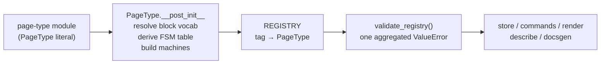
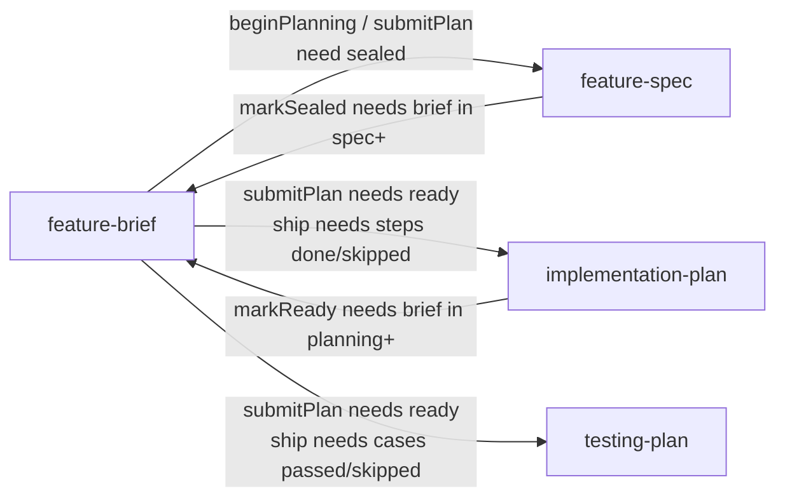

# Page Type Definitions

# Page Type Definitions (`src/pagetypes/`)

Every page in pasta is an instance of a **page type**: a declaration of what sections a page has, what commands may edit them, what lifecycle statuses it moves through, and what must be true before it may move. This module holds those declarations — one module per type — plus the registry that resolves a tag to a type.

The declarations are pure data. Nothing here reads or writes a page, evaluates a guard, or renders anything. `PageType` is a frozen dataclass; the modules beside it are almost entirely one large literal each. All behaviour lives in the consumers (`src/store.py`, `src/commands.py`, `src/render*.py`, `src/describe.py`), which read these declarations to decide what is legal, what to persist, and what to advertise over MCP.

## Layout

| Path | Holds |
| --- | --- |
| `core/specs.py` | The kind constants (`SCALAR`/`PROSE`/`LIST`/`BLOCKS`, the command kinds) and the spec dataclasses that depend on neither a field nor a page type: `FSMSpec`, `ElementFSMSpec`, `RefCheck`, `ChildStateGuard`, `ParentStateGuard`, `AutoChildSpec`, `WorkspaceGuidanceSpec` |
| `core/args.py` | `ArgSpec`, `BlockKindSpec`, `ElementBlocksSpec`, the arg helpers (`_text`, `_integer`, `_boolean`, `_array`, `_object`) and the block-kind helpers (`_paragraph_runs`, `_code_block`, `standard_blocks`, …) |
| `core/fields.py` | `FieldSpec`, `SectionSpec`, and the declaration helpers `_scalar` / `_prose` / `_list` / `_blocks` |
| `core/commands.py` | `CommandSpec` and the command factories (`set_prose_cmd`, `list_cmds`, `blocks_cmds`, `transition_cmd`, …) |
| `core/pagetype.py` | `PageType`, its post-init setup, and the accessors `get_pagetype_field` / `get_pagetype_command` / `initial_sections` |
| `core/validation.py` | Declaration-time validators plus the runtime block/inline-run grammar checks the command layer calls |
| `architecture.py`, `bug_report.py`, `decision_record.py`, `document.py`, `epic.py`, `feature.py`, `simple_change.py`, `toc.py` | The twelve page types, one module per type — except `feature.py` and `epic.py`, which each declare a parent plus the children pinned under it |
| `_stage_guidance.py` | The per-status stage instructions a type hangs on its FSM |
| `_workspace_guidance.py` | The field names and descriptions for per-workspace configurable guidance |
| `_registry.py` | `REGISTRY`, the accessors every consumer reads through, `validate_registry()`, and the test-mode switch |

`__init__.py` and `core/__init__.py` deliberately re-export nothing — consumers import from the concrete submodules, so there is no export list to keep in step.

## What a `PageType` declares

```python
PageType(
    tag,                  # the stable identifier ("feature-brief")
    name,                 # human label ("Feature (root)")
    description,          # what the type is for, and when to pick it over a sibling
    sections,             # tuple[SectionSpec, ...] - the content model
    commands,             # tuple[CommandSpec, ...] - the whole authoring surface
    fsm,                  # FSMSpec - the page's status lifecycle
    auto_children=(),     # pinned children created with the page
    workspace_guidance=(),# per-workspace texts surfaced at some statuses
)
```

### Sections and fields

A section is a named group of fields; a field is one of four kinds, each with a helper so the declaration reads as prose:

| Helper | Kind | Shape on the page | Empty default |
| --- | --- | --- | --- |
| `_scalar("kind", choices=...)` | `SCALAR` | one value, optionally an enum | `None` |
| `_prose("body")` | `PROSE` | one text blob | `""` |
| `_list("items", element_fields=(...))` | `LIST` | ordered id'd elements, each with the named fields | `[]` |
| `_blocks("body", block_kinds=(...))` | `BLOCKS` | ordered id'd typed blocks | `[]` |

`initial_sections(page_type, existing=None)` produces those defaults. It is idempotent: passing an existing page's sections backfills only what the type has gained since, so the same function seeds a new page and migrates an old one.

Every `FieldSpec.description` is the field's **authoring instruction** — the long, indented text you see throughout `feature.py` and friends. It is dedented and stripped in `FieldSpec.__post_init__`, and it belongs on the field exactly once: `validate_pagetype_setter_descriptions` rejects a command that copies it into its own description. The instruction reaches an agent through `describePageType`'s `sections` listing.

A `LIST` field can carry two extras. `element_fsm=` gives each element its own tiny lifecycle (below), and `element_blocks=(ElementBlocksSpec("detail", (...)),)` makes one element field hold blocks rather than a scalar — `implementation-plan`'s steps are the only production use, where each step's `detail` is a paragraph/code array. `title_element_field()` decides whether elements render with a heading, and it reads only the declaration: a list naming `title` or `name` in `element_fields` heads every element, one naming neither heads none.

### Commands

A command is a `CommandSpec`: a name, a kind, the args it takes, the `(section, field)` it targets, and where it is legal. The factories in `core/commands.py` are pure and return one spec or a tuple to spread into `commands=(...)`:

| Factory | Produces |
| --- | --- |
| `set_prose_cmd(section)` | `set<Section>` for a prose field |
| `set_scalar_cmd(section, field)` | `set<Field>` for a scalar |
| `list_cmds(section, ...)` | `add<Noun>` / `remove<Noun>` / `reorder<Noun>`; any subset via `add=`/`remove=`/`reorder=` |
| `element_cmds(section, marks=...)` | one `ELEMENT_TRANSITION` per mark, each led by the derived `<noun>Id` |
| `set_element_field_cmd(section, name=, const=)` | stamps a fixed `(field, value)` onto one element — the flag shape (`markCommitStale`, `escalateQuestion`) |
| `blocks_cmds(section)` | a blocks field's whole surface: add / remove / reorder |
| `element_blocks_cmds(section, element_field)` | the same three for a block-bearing element field (`addStepDetail`, …) |
| `transition_cmd(name, "from -> to")` | a page-status edge |
| `transition_on_add_cmd(...)` | a `COMPOUND` that adds an element **and** fires a transition atomically |
| `add_link_cmd()` / `set_title_cmd()` | the two universal commands, always legal, on every authorable type |

Names and the `<noun>Id` argument are **derived** from the section/field, so the minimal call carries no plumbing: `list_cmds("constraints", ...)` yields `addConstraint` / `removeConstraint` / `reorderConstraint`. The singularizer (`_singular`) handles `codeReferences → codeReference` and `dependencies → dependency`; where it misfires you pass `singular=`. Both real cases are in the tree and commented: `dispatches` would derive `addDispatche`, and `acceptance.criteria` would derive `criteria`.

Two structural invariants hold by construction rather than by convention: every `LIST` field gets a reorder, and every add supports a positioned insert. The shared `_INDEX` / `_PRECEDING` args carry that — `index` is the destination slot and `precedingId` is the stale-read guard, the id the caller expects immediately before it. Reorders use a required `toIndex` plus the same `precedingId`.

There is **no in-place block edit**. A block is replaced by removing it and adding at its slot, which the add's `index`/`precedingId` already express; the replacement gets a new id.

Two rules the validators enforce on a type's command set:

- At most one *field setter* (`SET_SCALAR` / `SET_PROSE` / `ADD_ELEMENT` / page-level `ADD_BLOCK`) per `(section, field)`. `is_field_setter` is the shared classifier, and the self-direction `do` list names one command per field, so a second would be silently dropped rather than reported.
- Every block-carrying argument must resolve to a real blocks field. `PageType` fills those vocabularies in best-effort; `validate_pagetype_block_args` is the matching check.

### The status FSM

`FSMSpec` stores the status set, the initial status, the terminal statuses and the per-status guidance — but **not** the transition table. That is derived from the commands by `_status_transitions(page_type)`: every `TRANSITION` or `COMPOUND` command with an `event` and a `dest` owns one edge, and `legal_in` supplies its source statuses. A command legal in several statuses expands to one `(event, source, dest, agency)` tuple per source. Nested `COMPOUND` sub-steps are not walked — the outer command owns the edge.

That is why `transition_cmd` reads the way it does: the description *is* the edge.

```python
transition_cmd("submitForReview", "building -> review")
```

`->` becomes `→`, the destination is the first word after the arrow (a trailing parenthetical is ignored, so `"review -> shipped (human gate)"` resolves to `shipped`), and the text before the arrow is the source unless `legal_in=` overrides it — which it must for a multi-source edge such as `abandon`. `event` defaults to the command name.

On top of FSM topology a transition may carry:

- `requires=((section, field), ...)` — content that must be populated first. This is why `beginGrounding` needs only the summary while `beginSpec` needs the whole grounded base.
- `guards=` / `parent_guards=` — cross-page preconditions, evaluated in the store (below).
- `agency="agent" | "human" | "either"` — who may fire it. `ship` and `close` are human gates.

`terminal_states` is a blanket authoring lock: while a page sits in one, `legal_commands` (`src/commands.py`) refuses every authoring command but leaves status transitions alone, so a terminal status can still offer `reopen` or `author`. It is an explicit declaration, never inferred from a status having no outgoing edges. A single command can opt back in by naming the terminal status in its `legal_in` — the one production case is a decision record's `supersededBy`, `legal_in=("authoring", "accepted")`, because a record is overtaken long after it is accepted.

`legal_in` on a content command is the finer-grained alternative: the planning children use no `terminal_states` at all and instead scope structural edits to `("draft",)` while leaving execution marks legal in `("draft", "ready")`.

### Element lifecycles

`ElementFSMSpec` gives one list element its own small state machine — a step's `todo`/`done`, a case's `pending`/`passed`/`failed`, a dispatch's five states. Unlike the page FSM it **keeps its own transition table**, because an `element_transition` command names only the event it fires (its `legal_in` is the *page* status lock, not the element's source state), so there is nothing to derive.

`checkmark_done` names the state that renders as `[x]`; the `initial` state is then `[ ]`, and every other state — and every element FSM leaving it `None` — renders with no box.

One spec may be declared on several page types (`_QUESTION_FSM` is declared in both `feature.py` and `epic.py`). `machine` and `machine_error` are excluded from the dataclass's identity and compare, so a shared spec stays one value.

### Blocks

A `BLOCKS` field declares a closed vocabulary of `BlockKindSpec`s, each with `body_args`. `standard_blocks()` is the full set (paragraph, heading, code, list, quote, table, divider) and only `document` takes it whole; typed pages take a narrow slice — `architecture.details` accepts a rich paragraph and a code block, `decision-record.consequences` accepts paragraphs only.

The same `kind` name can carry a different body in a different field, which is what a per-field override is: `_paragraph_runs()` gives a paragraph rich inline runs, `_paragraph_text()` gives it one plain `text` arg. Rich text is an array of **inline runs** — a bare string, `{"text", "bold"?, "italic"?, "href"?}`, `{"code"}`, or `{"ref": pageId}` — and markdown emphasis inside a text run is rejected outright (`_MARKDOWN_TOKENS`), so emphasis is structural.

A block's kind travels as data inside the add's argument, which is what replaces one add command per kind. The field declares its vocabulary once; `PageType._resolve_block_vocabularies` copies it onto the argument so the command layer and the validator read a single declaration. `feature-spec.decisions` shows why a `BlockKindSpec` can own a `ref_check`: the referencing argument (`questionId`) lives *inside* a block, not flat on a command.

### Cross-page declarations

Four specs describe things a single page cannot check itself. All four are evaluated in `src/store.py`, which can see other pages; the declaration here says only what must hold.

| Spec | Meaning |
| --- | --- |
| `RefCheck(arg, scope="parent", section, field)` | the named argument must be an existing element id in the parent's list field; a dangling id aborts the commit |
| `ChildStateGuard(child_type, allowed, message, section=, field=)` | over children: page form checks the child's own status; element form checks every element in that child's list field |
| `ParentStateGuard(parent_type, required_statuses, message)` | the mirror image — the parent's status must be in the set; a page with no such parent is unconstrained |
| `AutoChildSpec(type)` | a child created in the same commit as the page. Being an auto-child is what makes a page *pinned*: it cannot be reparented, reordered, or archived alone. The fact lives on the parent type and is never stored on the child |

Child guards are checked before parent guards, in both `_first_guard_failure` and `_check_guards`.

### Guidance

Two kinds, both surfaced to agents rather than enforced:

**Stage guidance** (`_stage_guidance.py`) is the instruction a page hands an agent on entering a status, declared as `status_guidance=(("building", BUILDING), ...)` and normalized by `FSMSpec.__post_init__` exactly as a field description is. It lives in its own module so one working discipline can reach several types and can be read as prose. The naming rule is load-bearing: a **bare** name is the only text for that status anywhere (`REVIEW`, shared by `simple-change` and `bug-report`), while a **prefixed** name is one type's own take on a status several types claim (`FEATURE_BRIEF_REVIEW`, `BUG_REPORT_DRAFT`, `SIMPLE_CHANGE_DRAFT`).

**Workspace guidance** (`_workspace_guidance.py`) is mutable and per-workspace: only the field name and description are fixed in code. Two fields exist — `mergeProcess` and `testingTool` — declared by `bug-report`, `simple-change` and `feature-brief` with `guidance_for` naming the statuses at which each shows. The descriptions are constants because `validate_workspace_guidance` requires every type sharing a field to give it the same description.

## From declaration to served surface



`PageType.__post_init__` does the setup a declaration needs before anything reads it, in order: resolve each block argument's vocabulary from its target field, write the derived transition table onto the FSM, then build the status machine and every element machine the type declares (via `try_build_machine` in `src/fsm.py`). The build is each spec's own well-formedness check, so it runs at declaration rather than first use — but a failure is *held* in `machine_error`, not raised, so one bad type does not stop the package importing. `validate_page_machine` is what reports it.

Well-formedness is a separate concern from setup. `validate_page_types(REGISTRY)` walks every type — every field, the FSM spec, the built machine, the field-setter and description rules, the block arguments — and raises one aggregated `ValueError` listing every finding, each prefixed with the page tag. `validate_registry()` is the single entry point the primary flows call (server start, HMR reload), so a misconfigured type fails loudly at load rather than surfacing piecemeal in a request.

## The registry and test mode

`_registry.py` holds `REGISTRY` (tag → `PageType`), but **read it through `registered_pagetypes()`**, not directly. The accessor is what applies test mode, so resolution, the `describePageType` listing and doc generation all agree on which types exist. `get_page_type(tag)` adds the off-limits guard and returns `None` for an unknown tag.

Test mode swaps the hand-authored `test-*` fixtures in `src/testtypes.py` in for the production types. Entering it **empties** `REGISTRY` into a private stash and leaving puts it back, so production types are unreachable through the map itself and not merely behind the accessors. The map is mutated in place and never rebound, so a reference taken before the switch stays live. `guard_production_type` reads the stash and raises `ProductionTypeInTestError` from both resolution and creation, steering a test toward a fixture instead of leaving it with a missing type. `tests/conftest.py` flips it on for the whole run at import, ahead of collection.

Two more accessors round it out: `is_auto_child_type(parent_type, child_type)` answers whether a child is pinned, and `workspace_guidance_fields()` returns the fields a workspace may configure, mapped to the first spec that declared each.

## The twelve types

| Tag | Module | Statuses | Notes |
| --- | --- | --- | --- |
| `feature-brief` | `feature.py` | draft → grounding → spec → planning → planReview → building → review → shipped / abandoned | the full lifecycle; three pinned children |
| `feature-spec` | `feature.py` | draft → sealed | terminal; sealing locks all authoring |
| `implementation-plan` | `feature.py` | draft → ready | steps with a `todo/done/skipped` element FSM and block-bearing `detail` |
| `testing-plan` | `feature.py` | draft → ready | cases with a `pending/passed/failed/skipped` element FSM |
| `epic` | `epic.py` | draft → grounding → decomposition → planReview → executing → review → shipped / abandoned | decomposes into child feature-briefs |
| `agent-plan` | `epic.py` | draft → ready | pinned under an epic; dispatches with a five-state element FSM |
| `bug-report` | `bug_report.py` | draft → open → review → done → closed | no terminal statuses — `closed` stays authorable |
| `simple-change` | `simple_change.py` | draft → open → review → done → closed | same flow, no planning or spec gates |
| `architecture` | `architecture.py` | authoring ↔ current | documents code that exists; `current` is terminal |
| `decision-record` | `decision_record.py` | authoring ↔ accepted | `accepted` is terminal bar `supersededBy` |
| `document` | `document.py` | active | the richest block surface; `standard_blocks()` |
| `toc` | `toc.py` | active | no sections, no commands at all |

### The feature family

`feature.py` declares four types in one module on purpose: they are designed against each other, and the coupling runs both ways.



Downward, the brief's transitions carry `ChildStateGuard`s: `submitPlan` needs both plans `ready` and the spec still `sealed` — the spec guard is repeated even though `beginPlanning` already required it, because a spec can be `reopen`ed mid-planning. `submitForReview` and `ship` use the element form, requiring every step done-or-skipped and every case passed-or-skipped; a deliberately skipped item counts as addressed at both gates.

Upward, the children's finalize transitions carry `ParentStateGuard`s (`_FEATURE_IN_SPEC_OR_LATER`, `_FEATURE_IN_PLANNING_OR_LATER`), which is how the spec is unlocked one stage before the plans are.

The `implementation-plan` is also the module's most interesting content model. `list_cmds("steps", add_args=(), element_blocks=("detail",))` gives `addStep` a single optional blocks argument, so one command creates a step *and* fills it — which is what keeps a batch from having to name an id it has not committed. `element_blocks_cmds("steps", "detail")` then supplies the append-later surface; without it a step's detail would be write-once, and fixing one would cost the step its id and its `todo`/`done` state.

### The epic family

`epic.py` follows the same shape one level up. An epic decomposes into child feature-briefs and is built by subagents dispatched from its pinned `agent-plan`. Its `ship` guard requires every child feature-brief to be `shipped`; its `submitForReview` guard uses the element form against the agent plan's dispatches, which is exactly why `accepted` is the single success terminal of `_DISPATCH_FSM` — a guard whose allowed set is just `("accepted",)` only works if there is one way to succeed.

A fix round is a `redispatch` of the same element rather than a new one, so the element itself records how many attempts a workstream took. The agent plan's `addDispatch` carries a `RefCheck` pointing `workstreamId` at the parent epic's `workstreams` list.

### The lightweight trackers

`bug-report` and `simple-change` share a flow (`draft → open → review → done → closed`), the `REVIEW` stage guidance, and both workspace-guidance fields. Both use `transition_on_add_cmd` for closing: `close` records a fix/change commit **and** fires `done → closed` atomically, with `closeWithoutCommit` as the message-only variant. Both are human gates. Neither declares `terminal_states`, so a closed page stays authorable and `reopen` returns it to `open`.

### The knowledge pages

`architecture` and `decision-record` both settle into a terminal status with an explicit way back (`author`). `architecture` is for code that exists today; `decision-record` is for the reasoning a shape cannot show, and is never edited to reverse itself — `supersededBy` is the forward pointer, and the one command that stays legal in the terminal status.

`document` and `toc` are the two ends of the range. `document` takes the whole standard block vocabulary; `toc` declares no sections and no commands, making it the only type without even `addLink` — a toc is shaped entirely by what is reparented beneath it, and its rendered child-pages list *is* its content.

One drift worth knowing: `ARCHITECTURE_AUTHORING` talks about marking a page stale, but the declared statuses are only `authoring` and `current`, where `markCurrent` is `authoring → current` and `author` is the way back. The guidance prose describes a status the FSM does not have.

## How the rest of the codebase reads this module

| Consumer | Reads |
| --- | --- |
| `src/server.py` | `validate_registry()` at start; `get_page_type` / `registered_pagetypes` for the MCP surface |
| `src/commands.py` | the pure mutation core — command kinds, `legal_commands` (which applies `legal_in`, `requires` and `terminal_states`), `initial_sections`, `guard_production_type` |
| `src/store.py` | everything cross-page: `RefCheck`, both guard kinds, `auto_children`, `status_guidance`, `workspace_guidance` |
| `src/describe.py` | `describePageType` / `describeMutations` — sections with their instructions, command summaries, status guidance, workspace-guidance fields |
| `src/render.py`, `src/render_html.py` | field kinds, `block_element_fields`, `title_element_field` |
| `src/fsm.py` | `try_build_machine(spec)` for both spec kinds |
| `src/docsgen.py` | `registered_pagetypes()` and `initial_sections` to generate type docs |
| `src/statecharts.py` | `REGISTRY` directly — the production types specifically are the point |

## Adding or changing a page type

1. New module beside the others, named for the tag, holding a single `_UPPER_CASE` `PageType` literal. Declare a parent and its pinned children in one module when they are designed against each other, as `feature.py` and `epic.py` do.
2. Sections first. Put each field's authoring instruction on the `FieldSpec` and nowhere else.
3. Commands next, via the factories. Let the names derive; pass `singular=` / `label=` / `name=` only where the derivation reads badly, and leave a comment saying why — every override in the tree has one.
4. FSM last: statuses, initial, and `terminal_states` only if you want the blanket authoring lock. The transition table writes itself from your `transition_cmd`s.
5. Register the tag in `REGISTRY` in `_registry.py`.
6. Run the test suite. `validate_page_types` is the gate, and its messages are tag-prefixed and aggregated, so one run reports every problem.

Traps worth naming up front:

- **A type with two blocks fields must pass distinct `remove_name` / `reorder_name`** or the generated command names collide. `decision_record` (`decision` + `consequences`), `feature-spec` (`design` + `decisions`) and `implementation-plan` (`steps.detail` + `dataModels`) all do.
- **A multi-source transition needs an explicit `legal_in`.** The description's "from" is prose in that case (`"drop the work -> abandoned"`) and only the destination is parsed out of it.
- **Test new capabilities on a `test-*` fixture.** Production types are unreachable from the suite by design; always prefer extending an existing fixture in `src/testtypes.py` over cloning a production type's shape.