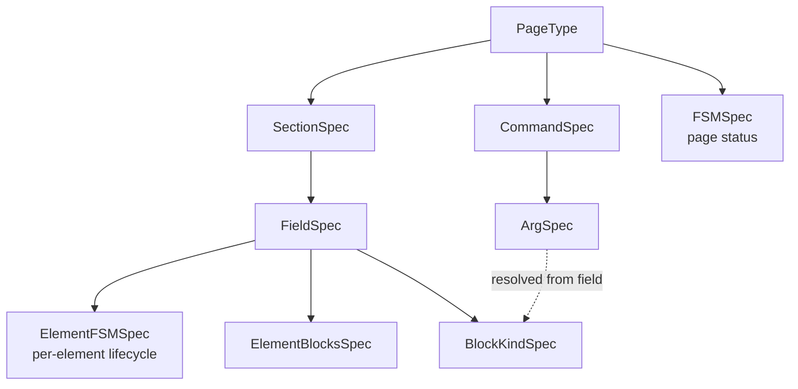
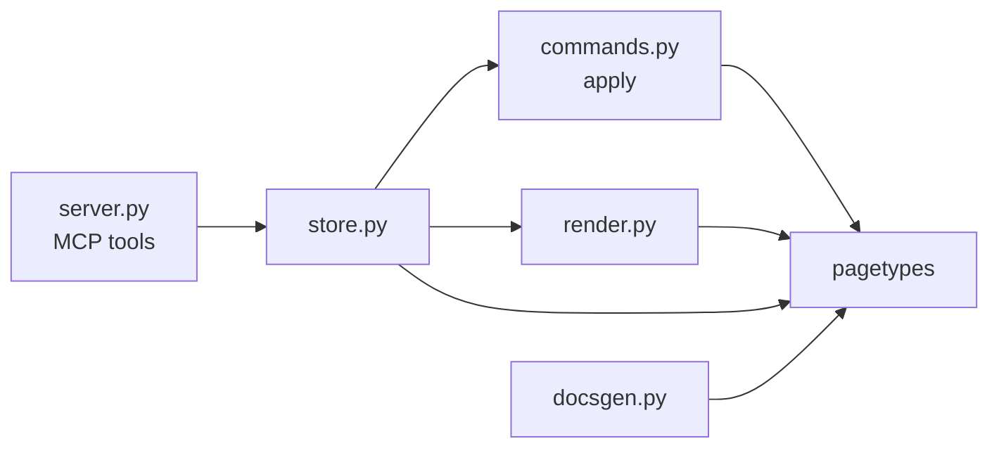

# Page Type Framework

# Page Type Framework (`src/pagetypes`)

A page type is a **declaration, not a class**: a frozen dataclass that says what a page of that type is made of (sections and fields), what can be done to it (commands), and how its status moves (an FSM). Everything downstream — the MCP tool surface, the mutation engine, the renderer, the docs generator — reads that one declaration instead of carrying per-type branches. Adding a page type means writing a `PageType` value in a new module and registering it; no consumer changes.

The package splits into three layers:

| Layer | Files | Role |
| --- | --- | --- |
| Vocabulary | `core/specs.py` | Kind constants and the leaf spec dataclasses that depend on nothing else |
| Building blocks | `core/args.py`, `core/fields.py`, `core/commands.py` | `ArgSpec` / `FieldSpec` / `CommandSpec` plus the terse factories a declaration is written with |
| Assembly & checking | `core/pagetype.py`, `core/validation.py`, `_registry.py` | `PageType` and its post-init setup, the declaration validators, and the tag → type map |

Both `__init__.py` files are deliberately empty — nothing is re-exported, so consumers import from the concrete submodule (`from .core.commands import list_cmds`) and there is no export list to keep in step.

---

## The shape of a declaration



The dotted edge is the one relationship not written by hand: a command's block-carrying argument gets its accepted kinds copied from the field it targets, at `PageType` construction time (see [Post-init](#post-init-what-construction-settles)).

### Fields (`core/fields.py`)

`FieldSpec` has four kinds, declared with the `_scalar` / `_prose` / `_list` / `_blocks` helpers:

- **`SCALAR`** — one value, optionally an enum via `choices`.
- **`PROSE`** — free text.
- **`LIST`** — an ordered array of elements. `element_fields` names each element's keys; `element_fsm` optionally gives every element its own tiny lifecycle; `element_blocks` marks element fields that hold blocks rather than a scalar.
- **`BLOCKS`** — an ordered array of typed blocks, constrained by `block_kinds`.

`FieldSpec.__post_init__` normalizes `description` (dedent a newline-stripped block, then rstrip) so an authoring instruction can be written as an indented triple-quoted string.

Three read accessors are written as free functions taking `self` rather than methods:

- `get_element_blocks(field, element_field)` — the `ElementBlocksSpec` for an element field, or `None` if it holds a scalar.
- `block_element_fields(field)` — the block-bearing element field names; what every consumer skips when treating an element's fields as scalar text (the renderer's `_render_list` calls this).
- `title_element_field(field)` — the element field that heads each element, chosen from `TITLE_ELEMENT_FIELDS = ("title", "name")` in precedence order, excluding block-bearing fields. Heading-ness is **declared, never inferred from values**: every element of a field renders the same shape.

### Args and block kinds (`core/args.py`)

`ArgSpec` is a JSON-Schema-ish argument: `name`, `type`, `required`, `choices`, `description`, plus two content-shape fields:

- `content` — which structured shape an `array`/`object` value must satisfy: `INLINE_RUNS`, `INLINE_RUN_LISTS`, `INLINE_RUN_GRID`, `TABLE_ALIGN`, or `BLOCK_ARRAY`. `None` means no shape check.
- `block_kinds` — for a `BLOCK_ARRAY` arg, the vocabulary it accepts. **Never written by hand**; filled in from the target field by `PageType`.

The `_text` / `_integer` / `_boolean` / `_array` / `_object` factories exist so an arg list reads as `(_text("file"), _integer("level"))`. `_same_named(args)` derives an `element_map` in which each arg maps onto a same-named element field — which is why no helper call site passes `element_map` explicitly: **the arg names are the field names**.

Two module-level args are shared by every positioned write:

```python
_INDEX      # optional: destination slot (append when omitted)
_PRECEDING  # optional: the id expected immediately before that slot
```

`precedingId` is the stale-read guard — a caller that read the list, then raced another writer, names an anchor that no longer holds and is rejected. The guard itself is enforced in the runtime mutation layer (`_resolve_slot` in `src/commands.py`), not here; this module only declares the args.

`BlockKindSpec` is one accepted block kind: a `kind` name, the `body_args` a block of that kind carries, and an optional `ref_check`. The `ref_check` lives on the kind rather than flat on a command because the referencing argument sits *inside* a block. The same kind name can carry a different body in a different field — that is what a per-field override is.

The block-kind factories mirror the arg factories: `_paragraph_runs()`, `_heading_runs()`, `_code_block()`, `_list_block()`, `_quote_block()`, `_table_block()`, `_divider_block()`, plus `_paragraph_text()` / `_heading_text()` for fields that want plain text instead of rich runs. `standard_blocks()` returns the whole canonical vocabulary — what a field passes to accept everything.

### Inline runs

Rich text inside a block is an ordered array of **runs**. A run is a plain string, `{"text": …, "bold"?, "italic"?, "href"?}`, `{"code": …}`, or `{"ref": "<pageId>"}`. Markdown syntax inside a text run is rejected: emphasis must be a structured run. The rejected token set (`_MARKDOWN_TOKENS = ("**", "`", "](")`) is kept deliberately narrow so ordinary prose containing a lone `*` or `_` survives.

The four content shapes nest predictably: `INLINE_RUNS` is `[run, …]`, `INLINE_RUN_LISTS` is `[[run, …], …]` (list items, quote paragraphs, table header cells), `INLINE_RUN_GRID` is rows of cells, and `TABLE_ALIGN` is a flat array of `left|center|right|None`.

---

## Commands (`core/commands.py`)

`CommandSpec` is one declared operation. The kind constants:

| Kind | Writes |
| --- | --- |
| `SET_SCALAR`, `SET_PROSE` | a scalar / prose field |
| `ADD_ELEMENT`, `REMOVE_ELEMENT`, `REORDER_ELEMENT` | a `LIST` field |
| `SET_ELEMENT_FIELD`, `ELEMENT_TRANSITION` | one element (a flag; its own FSM event) |
| `ADD_BLOCK`, `REMOVE_BLOCK`, `REORDER_BLOCK` | a `BLOCKS` field, or an element's block array when `element_field` is set |
| `TRANSITION`, `COMPOUND` | the page status (compound = ordered sub-steps applied atomically) |
| `ADD_LINK`, `SET_TITLE` | the universal page-level operations |

Two fields deserve emphasis:

- **`legal_in` is the uniform "where is this legal" declaration.** On a content command it is a status-scoped lock; on a `TRANSITION`/`COMPOUND` it is the *source* status(es) of the FSM edge. One concept, one field, across every kind.
- **`element_field`** is the single seam routing an `ADD_BLOCK`/`REMOVE_BLOCK`/`REORDER_BLOCK` to an element's block array instead of the section's own. `None` means the section's own blocks field.

Cross-page concerns ride along as declarations evaluated later in the store, which is the only layer that can see other pages: `ref_check` (a `RefCheck` — an arg must name an existing element id), `guards` (`ChildStateGuard` — every child of a type, or every element in a child's list field, must be in an allowed status), and `parent_guards` (`ParentStateGuard` — the mirror image, looking up at the parent).

### Declaration helpers

Each helper is a pure factory returning a `CommandSpec` (or a tuple) to spread into `commands=(...)`. Names and the `<noun>Id` arg are **derived** from the section/field, so the minimal call carries no name plumbing:

| Helper | Produces |
| --- | --- |
| `set_prose_cmd(section)` | `set<Section>` — `SET_PROSE` |
| `set_scalar_cmd(section, field)` | `set<Field>` — `SET_SCALAR`, arg named after the field, carrying its `choices` |
| `list_cmds(section, …)` | `add<Noun>` / `remove<Noun>` / `reorder<Noun>`; subset via `add=`/`remove=`/`reorder=` |
| `element_cmds(section, marks=…)` | one `ELEMENT_TRANSITION` per `(name, event, description[, extra_args])` |
| `set_element_field_cmd(…, const=…)` | `SET_ELEMENT_FIELD` stamping a constant onto the id'd element |
| `blocks_cmds(section)` | `add<Label>` / `removeBlock` / `reorderBlock` for a page-level blocks field |
| `element_blocks_cmds(section, element_field)` | the same three, each led by the element id |
| `transition_cmd(name, "from -> to")` | a page-status `TRANSITION` |
| `transition_on_add_cmd(…)` | a `COMPOUND` that adds an element *and* fires a transition |
| `add_link_cmd()`, `set_title_cmd()` | the universal `addLink` / `setTitle` |

Naming is done by four small functions: `_cap` (leaves the rest of the word alone, so `dataModel` → `DataModel`), `_a` (indefinite article, so a generated description reads "an invariant"), `_singular` (rule-based: `-ies` → `-y`, trailing `-s` dropped), and `_setter_label` (the section for the conventional `body` field, the field key otherwise). Any of these can be overridden — `singular=`, `label=`, `name=` — where the derivation reads badly or gets a plural wrong.

`transition_cmd` parses its edge out of the description. A written `->` is substituted once to `→`, the text is split on it, and the **first word after the arrow is the destination** — a trailing parenthetical is ignored, so `"drafting -> review (needs a summary)"` resolves to `review`. The dest is not overridable; the source is the text before the arrow unless `legal_in` supplies it (for a multi-source edge, or one whose "from" is prose). `event` defaults to `name`. A description without a parseable arrow raises `ValueError` at import time.

`is_field_setter(command)` is the page-type-agnostic classifier behind the self-direction "do" list: a `SET_SCALAR`, `SET_PROSE`, `ADD_ELEMENT`, or a *page-level* `ADD_BLOCK`. An element-scoped `ADD_BLOCK` is not a setter (the element it fills must exist first), and neither are the structure, flag, element-FSM, transition, or universal commands. It lives in this module so the declaration-time validator and the runtime rollup read one rule.

---

## `PageType` and the derived FSM (`core/pagetype.py`)

```python
@dataclass(frozen=True)
class PageType:
    tag: str
    name: str
    description: str
    sections: tuple[SectionSpec, ...]
    commands: tuple[CommandSpec, ...]
    fsm: FSMSpec
    auto_children: tuple[AutoChildSpec, ...] = ()
    workspace_guidance: tuple[WorkspaceGuidanceSpec, ...] = ()
```

`FSMSpec` holds **only** the status set, the initial status, `terminal_states`, and `status_guidance`. The transition table is derived, not declared. `terminal_states` is explicit, never inferred from a status merely lacking outgoing edges: while a page sits in one, every authoring command is locked (`describeMutations` reports them unavailable, `mutatePageBatch` rejects them) but status transitions stay legal, so a terminal status can still offer a `reopen`. A command opts out by naming the terminal status in its `legal_in`.

`ElementFSMSpec` is the exception that proves the rule: it **does** keep its own transition table, because an `ELEMENT_TRANSITION` command only names the event it fires (its `legal_in` is the *page* status lock, not the element source state), so there is nothing to derive from.

### Post-init: what construction settles

```mermaid
graph LR
    A["PageType(...node[")"]"] --> B[_resolve_block_vocabularies]
    B --> C["fsm.transitions =<br/>_status_transitions(self)"]
    C --> D[_build_machines]
    D --> E["machine / machine_error<br/>on each FSM spec"]
    E --> F["validate_page_types(REGISTRY)<br/>at load"]
```

The dataclass is frozen, so all three steps write through `object.__setattr__`. None of them raise: **construction sets up, validation reports**. A failure is held on the spec for `validation.py` to surface, which is what lets the load-time validator aggregate every problem across the whole registry instead of dying on the first one.

**1. Block vocabularies.** `_resolve_block_vocabularies` rebuilds `commands` with each `BLOCK_ARRAY` arg's `block_kinds` filled in from the field it targets. `_resolved_arg` picks the element field as `command.element_field or (arg.name if command.kind == ADD_ELEMENT else None)` — because a `list_cmds` add carries one block arg *named after* each block-bearing element field, while an element-scoped block command names the field on the command. With no element field, the target must be a `BLOCKS` field and its kinds are copied over. This is best-effort and only ever *fills in*, never checks: an unresolvable target leaves `block_kinds` as `None` (the "not a block argument" sentinel) for `validate_pagetype_block_args` to report. Safe, because the primary flows validate before serving.

**2. The status table.** `_status_transitions` walks top-level commands and emits one `(event, source, dest, agency)` edge per source for every `TRANSITION`/`COMPOUND` with both `event` and `dest` set. A command legal in several statuses expands to several edges. **Nested `COMPOUND` sub-steps are not walked** — the outer command owns the edge, so the inner transition step does not double-count. Iteration follows declaration order.

**3. The machines.** `_build_machines` calls `_store_machine` on the status FSM and on every element FSM found by `element_fsm_sites`, which stores whichever of the built class or the error `try_build_machine` (from `src/fsm.py`) returned. The build *is* the well-formedness check — python-statemachine validates connectivity, unreachable states and trap states when it creates the class — so it runs with the declaration rather than on first use. An element spec already carrying a machine is left alone, because one spec may be declared by several page types. `machine` and `machine_error` are `init=False, compare=False`, so a shared spec stays a single value.

`element_fsm_sites(page_type)` returns `(section_key, field_key, spec)` for every element FSM. A list field is the only place one can attach, so this walk is the complete set.

### `initial_sections`

```python
initial_sections(page_type, existing=None) -> dict[str, dict[str, Any]]
```

The section/field state a new page starts with — `""` for prose, `[]` for list and blocks, `None` for scalar — or `existing` backfilled onto it. It is **idempotent**: anything already present in `existing` is carried over untouched, so the same function seeds a fresh page and backfills an older page against a type that has since gained a section or field.

### Lookups

`get_pagetype_command(page_type, name)` and `get_pagetype_field(page_type, section_key, field_key)` are linear scans returning `None` when absent. The mutation layer leans on the latter heavily (`_add_element`, `_element_transition`, `_field_setter_edge` all resolve their target field through it).

---

## Validation (`core/validation.py`)

This module carries two distinct jobs despite its module docstring naming only the first.

### Runtime grammar — the block/inline checks

Pure predicates the command layer runs *before* applying a write:

- `validate_inline_content(content, value)` — dispatches on the declared shape.
- `validate_block(entry, block_kinds)` — the block must name a kind the field declares and carry exactly that kind's body args. Because the body args come from the matched `BlockKindSpec`, a per-field override is honoured. Tables additionally go through `validate_table`, which checks that every row and `align` matches the header's column count.
- `validate_blocks(value, block_kinds)` — the array form.
- `collect_ref_ids(content, value, block_kinds=None)` — pulls every `{"ref": pageId}` out of an arg value so the store can integrity-check inline page references before writing (`_check_inline_refs`). It is deliberately **defensive**: it runs before grammar validation, so it ignores anything malformed and leaves rejection to `validate_block`. For a `BLOCK_ARRAY` it recurses via `_block_ref_ids`, reading the run-bearing keys off the declared kinds — without `block_kinds` it yields nothing rather than guessing.

A dangling `ref`'s *existence* is not checked here: the pure core cannot see other pages.

### Declaration validation — the load-time checks

`validate_page_types(registry)` is the single entry point. It walks every type, collects every error, and raises **one** aggregated `ValueError` listing all of them — or returns `None`. Per type, `validate_page_type` prefixes the page tag onto messages from:

| Validator | Rule |
| --- | --- |
| `validate_field_spec` | `block_kinds` only on a blocks field (and a blocks field declares some); no kind named twice; `element_blocks` only on a list field, each naming a declared element field exactly once. Recurses via `validate_element_blocks_spec`. |
| `validate_fsm_spec` | Every `status_guidance` pair names a declared status, none twice. Not folded into the machine build — python-statemachine has no notion of guidance. |
| `validate_page_machine` | The status machine and every element machine actually built. Reports the held `machine_error`, rewritten through `_in_declared_names` so the library's `state_<name>` attribute names read back as the author's status names (longest state first, so one name cannot be substituted inside another). |
| `validate_pagetype_field_setters` | At most one do-eligible setter per `(section, field)` — a second would be silently dropped from the self-direction rollup, failing as *missing guidance* rather than as an error. |
| `validate_pagetype_setter_descriptions` | A setter carries a short one-line description ("set the summary"), never its field's authoring instruction — that text lives once on `FieldSpec.description` and reaches an agent through `describePageType` and the `instruction` key of a `next` edge. |
| `validate_pagetype_block_args` | Every `BLOCK_ARRAY` arg resolved. The check side of the best-effort resolution above: an unfilled arg would accept any block, describe itself as an untyped array, and lose its cross-page ref check. |

`validate_workspace_guidance(registry)` runs across the whole map, not per type: each `WorkspaceGuidanceSpec` needs a non-empty field name and description, a non-empty `guidance_for` naming only the declaring type's own statuses, and a description that **agrees across every type sharing the field**.

---

## The registry (`_registry.py`)

`REGISTRY` maps tag → `PageType` for the twelve production types (architecture, decision record, bug report, simple change, the four feature types, epic, agent plan, document, toc). `validate_registry()` calls `validate_page_types(REGISTRY)` and is what the primary flows — server start, HMR reload — call so a misconfigured type fails loudly at load.

**Read types through `registered_pagetypes()`, not from `REGISTRY`.** The accessor is what applies test mode, so resolution, the `describePageType` listing, and doc generation all agree on which types exist. Name `REGISTRY` directly only where the production types specifically are the point — as `validate_registry` does.

### Test mode

`set_test_mode(True)` swaps in the hand-authored `test-*` fixtures from `src/testtypes.py`, each a minimal page type demonstrating one capability so tests exercise the full surface without pinning to any production type's shape. `tests/conftest.py` flips it on for the whole run at import, ahead of collection, so test modules can resolve fixtures at module level.

The mechanism matters: entering **empties `REGISTRY` into a private stash** and leaving puts it back, so production types are unreachable through the map itself and not merely behind the accessors. The map is mutated in place, never rebound, so a reference taken before the switch stays live. `guard_production_type(tag)` — shared by `get_page_type` and page creation — reads the stash and raises `ProductionTypeInTestError`, steering the author to a `test-*` fixture rather than leaving them with a silently missing type. `is_test_mode()` is the supported way to ask which registry is in play (the docs generator's `_bindings_module` branches on it).

`_test_registry()` imports `src.testtypes` at call time, not at module top, because the fixtures build on this package's core blocks — a top-level import would be circular.

### Other accessors

- `is_auto_child_type(parent_type, child_type)` — whether a child is auto-created. Being an auto-child is what makes a page *pinned*: it cannot be reparented, reordered, or archived on its own. That fact lives on the parent type and is never stored as a field on the child.
- `workspace_guidance_fields()` — every declared guidance field mapped to the first spec to declare it. Reads whichever registry is in play, so a fixture's field is never offered in production.

---

## How the rest of the codebase consumes this



- **`src/server.py` → `src/store.py`** — every page-facing MCP tool (`renderPage`, `archivePage`, `unarchivePage`, …) reaches a page type through `get_page_type` → `registered_pagetypes`, so test mode applies at every entry point.
- **`src/commands.py`** resolves the target `FieldSpec` via `get_pagetype_field` before applying an add, an element transition, or a field-setter edge, and enforces the positioning guard the `_INDEX`/`_PRECEDING` args declare.
- **`src/store.py`** owns everything cross-page: `collect_ref_ids` for inline-ref integrity, `get_page_type` + `is_auto_child_type` for pinned-child protection, `_create_auto_children` for `AutoChildSpec`, and the evaluation of `RefCheck` / `ChildStateGuard` / `ParentStateGuard`.
- **`src/render.py`** walks the tree resolving each page's type, and reads `block_element_fields` so an element's block-bearing fields are not rendered as scalar text.
- **`src/docsgen.py`** seeds pages with `initial_sections` and branches on `is_test_mode()`.

---

## Adding or changing a page type

1. Create `src/pagetypes/<name>.py` with a module-private `_MY_TYPE = PageType(...)`.
2. Build sections from `_scalar` / `_prose` / `_list` / `_blocks`. Put the authoring instruction on `FieldSpec.description` — once, there, not on the setter.
3. Build the command surface from the helpers. Spread `list_cmds(...)` / `blocks_cmds(...)` into `commands=(...)`; add `add_link_cmd()` and `set_title_cmd()` unless the type is command-less.
4. Declare the `FSMSpec` with its states, initial status, `terminal_states`, and per-status `status_guidance`. Write each edge as a `transition_cmd` — never as a transition table.
5. Register the tag in `REGISTRY` in `_registry.py`.
6. Run the tests. `validate_registry()` fires at load and reports every declaration error at once.

### Invariants that hold by construction

- Every list field has a reorder, and every add supports a positioned insert — `list_cmds` always emits them with the anchored `toIndex` + `precedingId` guard.
- A status edge lives in exactly one place: the command that declares it.
- A block's kind travels as data inside the argument, which is what replaced one add command per kind. There is no in-place block edit — remove and re-add at the slot; the replacement is a new block with a new id.
- A field's block vocabulary is declared once and flows to the command arg, the describe output, and the validator.

### Rough edges worth knowing

- **Two different `<noun>Id` derivations.** `list_cmds` and `element_blocks_cmds` derive their noun from the *field* (falling back to the section only when the field is the generic `items`); `element_cmds` and `set_element_field_cmd` derive it from the *section* unconditionally. On a list whose field key is not `items`, the add/remove ids and the element-transition ids will disagree unless you pass `singular=` to match.
- `core/validation.py`'s module docstring describes only the inline/block grammar; the module also holds all the declaration validators. Similarly, `is_field_setter`'s docstring refers to "PageType's post-init validation" — post-init no longer validates, and the caller is `validate_pagetype_field_setters`.
- `PageType`'s frozen-ness is real for callers but bypassed internally via `object.__setattr__` in post-init. If you add a derived field, follow the same pattern and mark it `init=False, compare=False` so it stays out of the spec's identity.