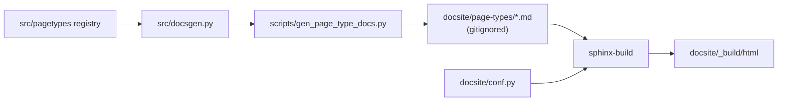

# Project Documentation

# Project Documentation

The root-level documentation surface of the pasta repository: the human-facing `README.md` and the agent-facing `CLAUDE.md` / `AGENTS.md`. These three files are the entry point for anyone — person or coding agent — arriving at the repo with no context. They are hand-authored prose, not generated, and they sit alongside (but are distinct from) the generated Sphinx reference under `docsite/`.

## Purpose and audience split

The module exists because pasta has two kinds of reader with genuinely different needs, and conflating them produces documentation that serves neither.

| File | Reader | Content | Stability |
| --- | --- | --- | --- |
| `README.md` | A developer evaluating or setting up pasta | What the server is, why the FSM-per-page design exists, quick start, the page-type lineup, how to write your own process | Hand-authored; changes when the product story changes |
| `CLAUDE.md` | A coding agent working *on* this repo | Project hints (vocabulary, test invocation), which MCP servers to prefer for code search, plus a tool-managed GitNexus block | Hand-authored top; machine-managed bottom |
| `AGENTS.md` | Same, for agents reading the vendor-neutral filename | Currently the GitNexus block only | Entirely machine-managed |

`README.md` is a *pitch plus a manual*. It leads with the problem statement (process in a prompt gets outcompeted by later tokens), then shows the mechanism — the `next` block with its `do` / `blocked` / `humanGates` / `attention` buckets — then the feature lifecycle as prose. It deliberately quotes real stage guidance verbatim rather than paraphrasing it, so the README doubles as a worked example of what the server actually returns.

`CLAUDE.md` is *operating instructions*. It carries no narrative; every line is an imperative an agent can act on.

## The managed-block convention

`CLAUDE.md` and `AGENTS.md` both contain a region fenced by HTML comments:

```markdown
<!-- gitnexus:start -->
# GitNexus — Code Intelligence
...
<!-- gitnexus:end -->
```

Everything between those markers is written by the GitNexus tooling and will be rewritten wholesale when the index is refreshed (the block embeds live counts — currently 2304 symbols, 6006 relationships, 199 execution flows). **Hand edits inside the markers are lost.** Project-specific guidance belongs above `<!-- gitnexus:start -->`, which is where the `# Project hints` and `# graphify` sections live in `CLAUDE.md`.

`AGENTS.md` currently consists of nothing *but* the managed block. If you want a hint to reach agents that read `AGENTS.md` rather than `CLAUDE.md`, you have to add it there explicitly — the two files are not symlinked or otherwise kept in sync.

Note that the GitNexus block and the `# graphify` hint point at two different code-intelligence MCP servers. Both are installed in this repo (`.gitnexus/`, `graphify-out/`, and the matching skills under `.claude/skills/`). The GitNexus block's rules are the stricter ones — impact analysis before editing a symbol, `detect_changes` before committing, `rename` instead of find-and-replace, and `risk: UNKNOWN` treated as unresolved rather than clear.

## Claims the README makes, and where they are backed

When you edit `README.md`, these are the statements that can silently drift out of true. Each is checkable against one place in the tree:

- **`uv run python main.py` → `http://localhost:8000`** — `main.py` defaults to `--host 0.0.0.0 --port 8000` and dispatches to `run_dev_server` in `src/hmr_server.py`. The undocumented `--stdio` flag takes the other branch, importing `src.server.mcp` directly and calling `mcp.run(transport="stdio")` for clients that spawn the server as a subprocess.
- **MCP at `/pasta/mcp`, web UI at `/`** — the mount is `Mount("/pasta", app=mcp_asgi)` plus `Mount("/", app=fastapi_dispatch)` in `src/hmr_server.py`; the non-reloading path mounts the same prefix in `src/server.py`.
- **Workspaces under `./.pasta-data`, overridable with `PASTA_DATA_DIR`** — `src/server.py` reads `os.environ.get("PASTA_DATA_DIR", ".pasta-data")`.
- **Python 3.14** — `requires-python = ">=3.14"` in `pyproject.toml`.
- **Hot reload keeps agent sessions connected** — the `/pasta/mcp` session manager lives in the stable outer ASGI app in `src/hmr_server.py`, which is why a module edit doesn't drop connections.
- **Stage prose lives in one file** — `src/pagetypes/_stage_guidance.py`. The per-type declarations (`feature.py`, `bug_report.py`, `epic.py`, `simple_change.py`, `architecture.py`, `decision_record.py`, `document.py`, `toc.py`) sit next to it under `src/pagetypes/`, registered through `src/pagetypes/_registry.py`.
- **The pure/impure split** — README names `model`, `pagetypes`, `fsm`, `commands`, `serialize` as the I/O-free core and `store`, `server` as the stateful shell. All seven exist as modules under `src/`.
- **The bundled skills** — `.claude/skills/pasta/SKILL.md` and `.claude/skills/cook/SKILL.md` are byte-identical apart from the `name:` frontmatter, matching the README's "same with a funnier name." Both are four lines of body telling the agent to call the server's `instructions` tool and nothing else, which is the point: the process lives in the server, not in the skill.

## Relationship to the generated docs

`README.md` documents the `just` recipes but is not itself part of any build. The generated documentation is a separate pipeline that the README only advertises:



`src/docsgen.py` holds all the content logic and is unit-tested: `all_state_docs()` returns one markdown document per page-type *state*, `render_states_index()` produces the toctree index at the stem named by `STATES_INDEX_STEM`, and `reachable_states()` / `page_machine_qualname()` supply the graph walk and the `statemachine-diagram` target. `scripts/gen_page_type_docs.py` is a thin driver that only does filesystem I/O, skipping unchanged files. The result is 40+ files like `feature-brief-building.md` and `bug-report-draft.md`, all under a gitignored `docsite/page-types/`.

Two things to know before touching this boundary:

- `docsite/page-types/` and `docsite/apidocs/` are both in `.gitignore`. Nothing in them is a source file; a clean checkout has no page-type docs until you run `just docs`.
- `just docs` opens with `rm -rf docsite/page-types`, while the generator's own docstring promises it does *not* delete stale files and does *not* touch hand-authored per-type overview docs at `page-types/<tag>.md`. Today no such hand-authored files exist, so the two are consistent. If you add one, the `rm -rf` will eat it — move it out of `page-types/` or drop the `rm` from the recipe.

The Sphinx build itself is configured by `docsite/conf.py`, which inserts the repo root on `sys.path` so `statemachine.contrib.diagram.sphinx_ext` can resolve the machine classes exposed in `src/statecharts.py`, and renders API docs via `autodoc2` over the `src` package.

## Task reference

The README lists a subset of the `justfile`. The full set, for contributors:

| Recipe | What it does |
| --- | --- |
| `just test` / `just testincr` | Full suite / `pytest --testmon` incremental. Both set `PYTHONDONTWRITEBYTECODE=1` |
| `just types` | `basedpyright` (config in `pyproject.toml`, `typeCheckingMode = "recommended"`, `include = ["src/**/*"]`) |
| `just main` | Run the server |
| `just docs` | Wipe `docsite/page-types`, regenerate, full `sphinx-build -a` |
| `just sphinx` | `sphinx-autobuild` on port 8081, watching `src`, regenerating page-type docs pre-build |
| `just dev` | `main` and `sphinx` in parallel (`[parallel]` attribute) |
| `just probe` | `scripts/mcp_probe.py` |
| `just brief-probe *ARGS` | Walk a feature brief through its whole lifecycle against a running server, printing each stage's `do` rollup (`--keep` to skip the archive) |
| `just validate` | `scripts/validate_workspace.py` |
| `just klaus` | Serve the repo with `klaus` |

`just probe`, `just brief-probe`, `just validate` and `just klaus` are undocumented in the README. `brief-probe` in particular is the fastest way to see the effect of a stage-guidance or edge change end to end, and is worth knowing about if you are editing `src/pagetypes/_stage_guidance.py`.

## Contributing to this module

**Editing `README.md`.** Keep the two-voice structure: argument first, mechanism second, reference last. The quoted `building` guidance and the `next`-block JSON are load-bearing examples — if you change the shape of the `next` envelope in `src/server.py` or the prose in `_stage_guidance.py`, the README quotes them and goes stale. Same for the feature lifecycle diagram: it mirrors `src/pagetypes/feature.py`, and the canonical rendering of that machine is the generated `docsite/page-types/feature-brief-*.md`, not the ASCII in the README. Adding a status to `feature.py` means touching the README's lifecycle block by hand.

**Editing `CLAUDE.md`.** Add above the `gitnexus:start` marker. Keep lines imperative and testable — `Use the word "create" instead of "mint"` is a good hint because an agent can comply with it unambiguously. To refresh the managed block, re-run the GitNexus indexer (`node .gitnexus/run.cjs analyze --index-only`) rather than hand-updating the symbol counts.

**Editing `AGENTS.md`.** Treat it as a second delivery channel for the same guidance, not a mirror. If a hint matters, put it in both files.

**The `docs/` directory** holds the README's screenshots (`pasta-ui-bug-example.png`, `pasta-ui-bug-model.png`) plus a vendored copy of the python-statemachine documentation under `docs/python-statemachine/`. That vendored tree is upstream reference material for working with the FSM library — not pasta's own docs, and not part of the `docsite/` build.