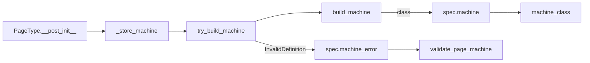

# State Machines & Statecharts

# State Machines & Statecharts

`src/fsm.py` and `src/statecharts.py` are the FSM layer: the place where "is this transition legal?" and "what status does it leave the page in?" are answered. Everything above them — the command layer, the store, the MCP tools, the docs generator — defers to this layer instead of re-deriving status rules from transition tables.

Two files, two jobs:

| File | Job |
| --- | --- |
| `src/fsm.py` | Build a `python-statemachine` class from a spec; evaluate legality and transitions against it. |
| `src/statecharts.py` | Serve each page type's status machine under a stable, importable name for the Sphinx diagram directive. |

The fixture counterpart of `statecharts` is `src/testcharts.py`, which binds the same names for the hand-authored `test-*` page types.

## The core idea: the machine is the authority

A `FSMSpec` (page status) or `ElementFSMSpec` (a list element's own lifecycle) is data — states, an initial state, and a transition table of `(event, source, dest, agency)` tuples. `fsm.py` turns that data into a real `StateMachine` subclass exactly once, and every legality question is then answered by *running* that machine rather than by scanning the tuples.

This matters because the tuple table and the machine can disagree in ways that only the library can see: unreachable states, trap states, an event whose alternatives fan out from several sources. Building the class is itself the well-formedness check — see [Validation](#validation-building-is-the-check).

Evaluation is stateless from the caller's point of view. `fire` and `allowed_events` each construct an *ephemeral* machine instance seeded at the caller's current status, ask it one question, and throw it away. No FSM instance is ever persisted; a page's status string is the only state that lives anywhere.

```python
machine = machine_class(fsm)(start_value=current_status)
```

## Public surface of `fsm.py`

### `build_machine(fsm) -> type[StateMachine]`

Constructs the class. Uncached by design — the caller keeps what it builds. Three details of the construction are load-bearing:

**States are named by value, not by attribute.** Each state is stored as `state_<value>` with `State(value, value=value, ...)`. This is what lets a page type declare an `open` state *and* an `open` event (bug-report does exactly this) without an attribute collision. Because of this, the current status is always read back from `configuration_values` — the state *values* — never from the attribute name. `_current_value` is the single place that does this read, and it assumes flat FSMs (exactly one active state).

**Terminal states are inferred.** python-statemachine's trap-state validation demands that a state with no outgoing transition be declared `final=True`. Rather than making every spec author remember that, `build_machine` computes the set of source states from the transition table and marks anything absent from it as final. Cyclic FSMs (architecture, bug-report) have no such states and are unaffected.

> This inference is about graph shape only. It is unrelated to `FSMSpec.terminal_states`, which is an explicit authoring-lock declaration consumed by `legal_commands` — a status can be authoring-locked while still offering a `reopen` edge, and a state with no outgoing edges is not automatically authoring-locked.

**Transitions are grouped by event and wrapped in `Event`.** Alternatives sharing an event id are OR-combined (`by_event[event] | segment`), so one command legal in several source statuses becomes one event with several segments. Each event is wrapped in `Event(transitions, name=event)` so generated diagrams label edges with the exact command name (`markStale`) instead of python-statemachine's title-cased default (`Markstale`). The attribute name still fixes the event id, so `send()` and `allowed_events` are unaffected by the display name.

The `agency` element of each transition tuple (`"agent"` / `"human"` / `"either"`) is not consumed here — it is carried for describe/next-actions purposes and deliberately ignored by the machine.

### `try_build_machine(fsm) -> (class | None, InvalidDefinition | None)`

The non-raising form: returns the class, or the `InvalidDefinition` that stopped it, never both. This exists so a malformed spec hands its error back to whoever owns it instead of exploding out of class creation at import time.

### `machine_class(fsm) -> type[StateMachine]`

Returns `fsm.machine` — the class built when the owning page type was declared. **It never builds.** A spec that no page type declares is unreachable in normal operation, so this raises `LookupError` rather than building on demand; building here would hand out a fresh, non-identical class on every call.

### `allowed_events(fsm, current_status) -> set[str]`

The event ids legal from a status, **by FSM topology only**. Required-content preconditions, the `legal_in` status lock, terminal-status authoring locks, and cross-page guards are all layered on top by `commands.py` and the store — none of them are visible here.

### `fire(fsm, current_status, event) -> str`

Sends the event and returns the resulting status value. A `TransitionNotAllowed` from the library is translated into the project's `IllegalCommandError`, so callers above this layer never see a python-statemachine exception.

### `is_valid_status(fsm, status) -> bool`

Plain membership in `fsm.states`. Used by the direct-status-edit path, which bypasses transitions entirely.

## Where machines come from

Nothing in `fsm.py` owns a registry or a cache. A `PageType`, in `__post_init__`, derives its status transition table from its own transition/compound commands (`_status_transitions`), then calls `_build_machines`, which routes each spec through `_store_machine` → `try_build_machine` and stores whichever of `machine` / `machine_error` came back. `machine` and `machine_error` are `compare=False, init=False` dataclass fields, so they take no part in a spec's identity — one `ElementFSMSpec` shared by several page types stays a single value, and the first declaring type to build it wins (`_build_machines` skips a spec that already has a machine or an error).



The set of specs a page type declares is exactly: its own `fsm`, plus every `element_fsm` hanging off a list field (enumerated by `element_fsm_sites`). There is no other attachment point, which is why an undeclared element spec is genuinely unreachable.

## Validation: building is the check

`validate_page_machine` (in `pagetypes/core/validation.py`) re-derives nothing. It simply reads `machine_error` off the status spec and off every element spec, and turns a non-`None` error into a validation message. python-statemachine's connectivity, unreachable-state and trap-state checks already ran during the build.

One translation happens on the way out: `_in_declared_names` rewrites `state_<value>` back to the state name the author declared, longest-first so a state whose name prefixes another isn't substituted inside it. Without this, an author would read an error about `state_shipped` for a state they wrote as `shipped`.

## How callers use this layer

`fsm.py` has **no outgoing calls** outside itself — it depends only on `python-statemachine`, `errors.IllegalCommandError`, and the two spec dataclasses. Everything is inbound.

**`commands.py`** is the main consumer, and it consistently treats `allowed_events` as *one* input among several:

- `legal_commands` calls `allowed_events` once per page, then combines topology (`_topology_ok`) with the `legal_in` status lock (`_status_ok`), required-content preconditions (`unmet_requirements`), and the terminal-status authoring lock.
- `_check_legal` calls `allowed_events` a second time purely to produce a better error: if topology permits the event but content is unmet, it names the empty fields instead of complaining about the status.
- `_apply` calls `fire` for a `TRANSITION` command and assigns the result to `page.status`.
- `_element_transition` calls `fire` against the *field's* `element_fsm`, using the element's own `status` (defaulting to the spec's `initial`), which is how an illegal element mark is rejected.
- `field_setter_edges` subtracts parent-blocked events from `allowed_events` before deciding which field setters to surface.

**`store.py`** uses `allowed_events` in `next_actions` when walking a subtree, and `is_valid_status` in `set_page_status` — the direct-edit path that assigns a status without firing an event, so it needs membership rather than reachability.

Three MCP tools bottom out here through short, uniform paths:

```
describeMutations → describe_mutations → legal_commands → allowed_events
nextActions       → next_actions       → legal_commands → allowed_events
route_set_page_status → set_page_status → is_valid_status
```

Doc generation follows the same shape offline: `scripts/gen_page_type_docs.py::main` → `all_state_docs` → `state_docs` → `describe_mutations` → `legal_commands` → `allowed_events`. Note that `state_docs` runs `legal_commands` with `ignore_requirements=True`, so a content-less page still enumerates a status's outgoing transitions on topology alone.

## `statecharts.py` — importable names for diagrams

The Sphinx `statemachine-diagram` directive addresses a machine by dotted import path. Page types build their machines at declaration time and hold them on the spec; `statecharts.py` exists only to give those classes an address.

It is a module-level `__getattr__`: on `src.statecharts.ArchitectureMachine`, it scans `REGISTRY` for a page type whose `fsm.name + "Machine"` matches, and returns `machine_class(page_type.fsm)`. An unmatched name raises `AttributeError`, which keeps `hasattr` honest.

Two properties are deliberate:

- **Resolved per call, against the live `REGISTRY`.** No snapshot is taken at import, so an HMR reload of the page types cannot leave a stale class bound here.
- **Production registry only.** The documentation site publishes the production types, so this module reads `REGISTRY` directly rather than whatever `registered_pagetypes()` currently returns. The test-mode counterpart is `testcharts.py`, which binds fixture machines as plain module attributes (`TestFlowMachine = machine_class(_page_fsm("test-flow"))`). `docsgen._bindings_module` picks between the two based on `is_test_mode()`, importing lazily so fixtures never enter a live server's import graph.

**Only page-status machines are served.** An element machine is reached through the field that declares it (`element_fsm_sites`) and is never diagrammed, so it needs no importable address.

The naming contract — spec name + `Machine` suffix — is enforced from the other side by `docsgen.page_machine_qualname`, which `hasattr`-checks the binding and raises `KeyError` if a type has no machine bound. That check is what stops a newly added page type from going silently undocumented, and `tests/test_docsgen.py` asserts it resolves for every registered and every production type.

## Contributing notes

- **Adding a status or transition to a page type** means editing its commands, not this module. `_status_transitions` derives the table from each `TRANSITION`/`COMPOUND` command's `legal_in` (source) and `dest` (destination), so a status edge lives in exactly one place. Nested compound sub-steps are not walked — the outer command owns the edge.
- **A spec that won't build** surfaces as a validation error from `validate_page_types`, not as an import-time crash. Read the message: it has already been rewritten into your declared state names.
- **Don't call `build_machine` from feature code.** Each call returns a *new* class, so identity comparisons and any per-class state would diverge. Go through `machine_class`, and if it raises `LookupError`, the real fix is to attach the spec to a page type.
- **Don't add guards or actions to the generated classes.** `docsgen` documents them as guardless: required-content preconditions and cross-page guards (`ChildStateGuard`, `ParentStateGuard`, `RefCheck`) live in `commands.py` and the store, and the diagram layer assumes the machine shows pure topology.
- **`_current_value` assumes flat FSMs.** If nested or parallel states are ever introduced, that `next(iter(...))` is the first thing that breaks.
- Tests live in `tests/test_fsm.py` (topology, illegal transitions, the shared state/event-name cycle, the undeclared-spec `LookupError`), `tests/test_statecharts.py` (registry resolution) and `tests/test_docsgen.py` (qualname binding for every type).