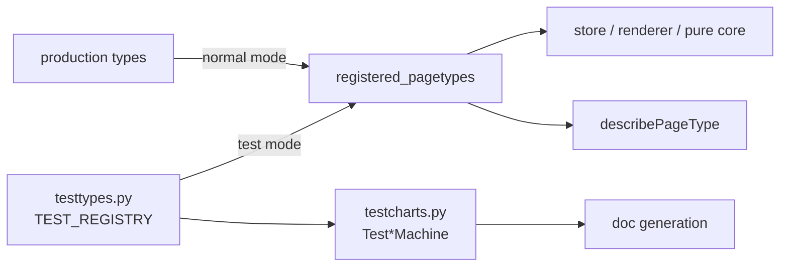
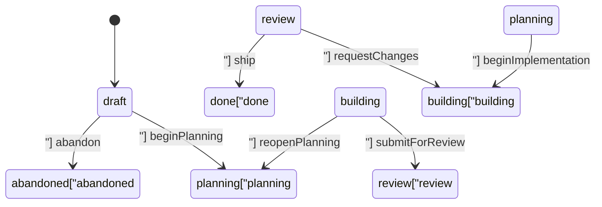

# Test Fixtures

# Test Fixtures (`src/testtypes.py`, `src/testcharts.py`)

Hand-authored page types that exist only to be tested against. They are **capability fixtures, not clones** of production types: each one is a deliberately small, purpose-built demonstration of a single capability cluster of the page-type system, named for the mechanic it exercises rather than for any production role.

The point of the split is churn isolation. Production page types can be enriched — a new field, a new status, a reworded description — without breaking a single assertion, because the assertions live against `test-*` fixtures instead. Production types are then verified only through the generic invariants, the registered set, the description directive, and doc generation.

---

## How fixtures enter the system

Under test mode, `registered_pagetypes()` (see `src.pagetypes._registry`) hands back `TEST_REGISTRY` instead of the production registry. Everything downstream — the store, the renderer, the pure core, `describePageType` — then treats a `test-lifecycle` page exactly like any other page. Outside test mode the fixtures neither resolve nor list; nothing has to be conditionally skipped, because they simply are not in the registry.



`TEST_REGISTRY` is just a tag-keyed dict built over the six module-level `PageType` constants:

```python
TEST_REGISTRY: dict[str, PageType] = {
    page_type.tag: page_type
    for page_type in (TEST_FIELDS, TEST_BLOCKS, TEST_ELEMENT_BLOCKS, TEST_FLOW, TEST_LIFECYCLE,
                      TEST_CHILD)
}
```

### Declaration uses the production helpers

Every fixture declares its commands through the **same shared factories the production types use** — `set_prose_cmd`, `set_scalar_cmd`, `list_cmds`, `element_cmds`, `set_element_field_cmd`, `blocks_cmds`, `element_blocks_cmds`, `transition_cmd`, `transition_on_add_cmd`, all imported from `src.pagetypes.core.commands` — plus the field specs (`_scalar`, `_prose`, `_list`, `_blocks`, `SectionSpec`) and arg specs (`_text`, `_boolean`, `_code_block`, `_paragraph_runs`, `_paragraph_text`, `_list_block`, `standard_blocks`, `BlockKindSpec`, `ElementBlocksSpec`).

Two consequences worth keeping in mind when editing:

1. A fixture reads like a production type, and doubles as coverage of those helpers.
2. The resulting command surface — names, args, legality, FSM edges, guards, ref-checks — is still exactly what it was when hand-written. The helpers are a spelling, not an abstraction that hides behaviour.

The only thing declared *locally* is the element FSMs, and only because of naming (below).

---

## Element FSMs

Three `ElementFSMSpec`s sit at the top of the module, prefixed and named distinctly from production:

| Spec | `name` | States | `checkmark_done` |
| --- | --- | --- | --- |
| `_STEP_FSM` | `TestStep` | `todo`, `done`, `skipped` | `done` |
| `_CHECK_FSM` | `TestCheck` | `pending`, `passed`, `failed`, `skipped` | `passed` |
| `_QUESTION_FSM` | `TestQuestion` | `open`, `answered` | — (none) |

The distinct naming is not cosmetic: **python-statemachine registers each class it builds under its qualname**, so a name collision with a production element FSM would be a real conflict, and the names also appear as diagram labels.

`_QUESTION_FSM` intentionally omits `checkmark_done` — that is the fixture for elements that render *without* a checkbox. Between `_STEP_FSM` and `_CHECK_FSM`, every checkbox render case is covered.

---

## The six fixtures

### `test-fields` — every non-block field kind

A pure content surface with no lifecycle: a single `active` status via `FSMSpec(name="TestFields", initial="active", states=("active",))`.

Covers the field kinds — plain `_scalar("label")`, enum `_scalar("kind", choices=("alpha", "beta", "gamma"))`, `_prose("body")`, and a plain `_list("items", element_fields=("text", "note", "flagged"))` with a required element field, an optional one, and a set-able flag. Commands cover the mutation patterns over them: `set_scalar_cmd`, `set_prose_cmd`, the `list_cmds` family (append, positioned insert, remove, reorder), and `set_element_field_cmd(..., const=("flagged", True))`.

### `test-blocks` — the blocks field

The richest content surface in four commands. `_blocks("body", standard_blocks(), ...)` declares no narrowed vocabulary, so the field accepts **every** standard block kind, and `blocks_cmds("body")` gives one add taking an array of kinded blocks, one generalized set that replaces any block whatever its kind, plus reorder, remove, and positioned insert.

The single terminal `active` status doubles as the single-state / terminal case for `render` and `reachable_states`.

### `test-element-blocks` — blocks on element fields

A list whose elements carry blocks under a **per-field kind restriction**, with both restriction cases present:

```python
element_blocks=(ElementBlocksSpec("snippet", (_code_block(),)),
                ElementBlocksSpec("detail", (_paragraph_runs(), _code_block(), _list_block()))),
```

`snippet` is code-only; `detail` is paragraph/code/list. The element carries `_STEP_FSM` too, so a checkbox, a title, and blocks render together.

The two-state `draft → ready` FSM exists for one reason: `markReady` `requires=(("items", "items"),)`, and the element-scoped commands are `legal_in=("draft",)`. That is the only way to observe **both** the draft-only content lock on those commands **and** their absence from the self-direction `do` list.

### `test-flow` — the simple status FSM

`draft → open → closed`, with `closed → open` back.

Three things are deliberate here:

- **Name collision.** The `open` *state* and the `open` *event* share a name; the FSM engine must handle it.
- **Compound transition.** `close` is declared with `transition_on_add_cmd`, so it records a commit into `resolution.commits` **and** fires `open -> closed`, atomically.
- **Terminal + override.** `closed` is in `terminal_states` yet keeps its `reopen` edge — the fixture for the terminal-status authoring lock's "transitions still allowed if any" branch. And `reorderCommit` names `closed` in its `legal_in`, fixturing the `legal_in` override of that lock.

`status_guidance` is supplied for `open` only, leaving `draft` and `closed` to fixture the unguided paths.

### `test-lifecycle` — the rich status FSM



(`abandon` is multi-source — `legal_in=("draft", "planning", "building", "review")`, OR-combined to the terminal `abandoned`; only one edge is drawn above to keep the diagram readable.)

What this fixture carries that no other does:

- **Required-content preconditions** — `beginPlanning` requires `summary.body`; `beginImplementation` requires `parts.items`.
- **Agency variety** — `agent` (default), `human` on `submitForReview` and `ship`, `either` on `reopenPlanning`, `requestChanges`, and `abandon`.
- **A page-status `ChildStateGuard`** — `beginImplementation` also requires the pinned `test-child` to be `ready`. It carries *both* a content precondition and a guard.
- **Element-status `ChildStateGuard`s** — `submitForReview` and `ship` each require every `test-child` step to be `done`-or-`skipped` (`section="steps"`) and every check `passed`-or-`skipped` (`section="checks"`). A skipped item counts as addressed at both gates. These are evaluated in the store, across the page's child pages.
- **A questions element-FSM + escalate** — `questions.items` carries `_QUESTION_FSM`; `answerQuestion` drives `open → answered`, and `escalateQuestion` sets `needsHuman` via `set_element_field_cmd`, feeding `attention`.
- **A pinned auto-child** — `auto_children=(AutoChildSpec("test-child"),)`, created in the same commit as the page.
- **Workspace guidance** — three `WorkspaceGuidanceSpec`s: one shown across two statuses (`buildTool`), one at a single status (`reviewHint`), one at the initial status (`draftHint`).
- **A wrapped multi-line field description** on `summary.body`, which no other fixture carries. It is what makes an instruction render as an indented block rather than inline after its marker — in generated docs and everywhere else a field's instruction is echoed.

### `test-child` — the pinned auto-child

The counterpart to `test-lifecycle`, and the densest fixture.

**Two element FSMs.** `steps.items` uses `_STEP_FSM`, `checks.items` uses `_CHECK_FSM` — together covering every checkbox render case.

**A `legal_in` content lock.** Structural edits (add/remove/reorder, `addDecision`, `addNote`) are `legal_in=("draft",)`; element-status marks (`markStepDone`, `markCheckPassed`, …) are `legal_in=("draft", "ready")`. Progress can still be recorded on a finalized plan; its shape cannot change.

**Two cross-page ref checks to the parent's questions**, covering both add paths:

```python
RefCheck(arg="questionId", scope="parent", section="questions", field="items")
```

One rides the `notes` list add (`list_cmds(..., ref_check=...)`); the other rides a custom `decision` block kind, which appears in *both* the `decisions` blocks field and the `note` element-blocks field on `steps`. The element-blocks placement is the important one — it is the only fixture for integrity a command-level check could never provide, because a block created together with its element hides its `questionId` inside an array entry, where `store._check_ref` (which reads one scalar argument) cannot see it.

**A per-field vocabulary with arg overrides.** The `decisions` field declares its own kinds rather than reusing `standard_blocks()`:

```python
_blocks("body", (
    BlockKindSpec("decision", body_args=(_text("questionId"), _text()),
                  ref_check=RefCheck(arg="questionId", scope="parent",
                                     section="questions", field="items")),
    _paragraph_text(),
), "decisions, each linked to a parent question"),
```

A custom kind the standard helpers do not provide, beside a standard `paragraph` whose body args are overridden to plain text. No other fixture exercises either, and both are the reason a blocks field may declare its own vocabulary.

**A `ParentStateGuard`.** `markReady` carries both a required-content precondition (`steps.items`) and:

```python
_PARENT_IN_PLANNING_OR_LATER = ParentStateGuard(
    parent_type="test-lifecycle",
    required_statuses=("planning", "building", "review", "done"),
    message="the test-lifecycle parent must be in planning or later",
)
```

A pinned child may only be finalized once its parent has reached `planning` or later — not while the parent is still `draft` (its base is not established), nor once `abandoned`. Evaluated in the store, this pair is the fixture for **parent-gated stage exposure**: the child's stage-required content is not yet the child's work, so `next_actions` withholds `addStep` from `do` until the parent unlocks the stage.

**A guided initial status.** `status_guidance=(("draft", ...),)` on the initial state is what makes `createPage`'s guidance echo testable.

---

## `src/testcharts.py` — the machine bindings

The fixture counterpart of `statecharts`. Because `registered_pagetypes()` returns the `test-*` types under test mode, **doc generation runs over them**, and the doc renderer resolves an importable machine class per page type by qualname. `testcharts` supplies exactly that:

```python
def _page_fsm(tag: str):
    page = TEST_REGISTRY.get(tag)
    if page is None:
        raise KeyError(f"Unknown page type {tag!r}.")
    return page.fsm

TestFieldsMachine = machine_class(_page_fsm("test-fields"))
# ... one per fixture
```

Two deliberate boundaries:

- **Bound here, not beside production.** Keeping these out of `statecharts` keeps that module's names to the types the documentation site actually publishes — so doc generation covers the fixtures without the site ever naming one.
- **Page machines only.** Element machines are not bound. Only a page's *status* machine is resolved by qualname, for the diagram directive on its state pages.

`_page_fsm` raises `KeyError` on an unknown tag, so a typo in a binding fails loudly at import rather than producing a silently missing machine.

---

## Contributing

**Adding a fixture.** Declare the `PageType` in `testtypes.py`, add it to the `TEST_REGISTRY` tuple, and bind a `Test<Name>Machine` in `testcharts.py`. Skipping the binding leaves doc generation without a resolvable machine for the new type.

**Adding an element FSM.** Declare it locally in `testtypes.py` with a `Test`-prefixed, production-distinct `name` — python-statemachine registers the built class under its qualname, and the name also becomes the diagram label.

**Before enriching a fixture, ask what it is *for*.** Each one is scoped to a capability cluster, and several of its oddities are load-bearing:

- the `open` state/event collision in `test-flow`
- `closed` being terminal *and* keeping `reopen`, plus `reorderCommit`'s `legal_in` override
- the wrapped multi-line description on `test-lifecycle`'s `summary.body`
- `_QUESTION_FSM` having no `checkmark_done`
- the `decision` block kind on `test-child`'s `steps.note` element field
- `test-element-blocks`' `markReady` requiring `items`

Each of these is the *only* instance of its case in the fixture set. Removing or "tidying" one silently drops coverage rather than failing a test. Prefer adding a new fixture over broadening an existing one past its stated cluster — and when a fixture does grow, extend the module or fixture docstring to say which mechanic the addition covers.

**Keep declaration going through the shared helpers.** A fixture that hand-rolls a command spec stops doubling as coverage of the helper it bypassed.