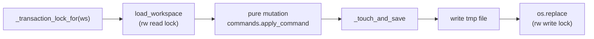

# Workspace Store & Persistence

# Workspace Store & Persistence

The store is pasta's stateful shell. Everything above it — the MCP tools and web routes in `src/server.py` — is I/O-free request handling; everything below it (`src/commands.py`, `src/fsm.py`, `src/render.py`, the page types) is pure. `Store` is the only place that touches the filesystem, takes locks, generates ids, or stamps timestamps.

One JSON file per workspace holds the workspace metadata and every page in it. There is no database, no per-page file, and no partial write: a workspace is loaded whole, mutated in memory, and written back whole.

## Layout

| File | Role |
| --- | --- |
| `src/store.py` | `Store` — the transactional API. Locks, file I/O, cross-page validation, id/revision stamping. |
| `src/model.py` | `Workspace` and `Page` dataclasses. Plain JSON-able values only. |
| `src/serialize.py` | `workspace_to_dict` / `workspace_from_dict` — the explicit on-disk shape. |
| `src/rwlock.py` | `ReadWriteLock` — writer-preferred, in-process. |
| `src/ids.py` | Id and revision-token generation, plus the `IdFactory` / `RevisionFactory` injection points. |
| `src/cleanup.py` | The hourly stamp/backup/prune sweep. Classification is pure; `Store` owns the transaction. |

`src/server.py:34-35` creates the single process-wide instance:

```python
DATA_DIR = os.environ.get("PASTA_DATA_DIR", ".pasta-data")
STORE = Store(DATA_DIR)
```

The root directory is created on construction. Workspace files live directly under it as `<id>.json`, with `:` rewritten to `_` — `_path_for` does the mapping because `:` is not a legal Windows filename character, and `_id_for_path` inverts it (replacing only the *first* `_`) so `list_workspaces` can lock a file before it has parsed the id inside. Backups live one level down in `backups/`, deliberately not beside the live files: `list_workspaces` globs `*.json` non-recursively, so a backup sitting next to its original would be listed as a duplicate workspace.

## The write pattern

Every mutating method follows the same four steps, and the docstring at the top of `store.py` is the canonical statement of it:

1. take the workspace's **transaction lock**,
2. `load_workspace` — parse a fresh in-memory copy from disk,
3. apply pure-core mutations to that copy,
4. `_touch_and_save` — serialize to a temp file and `os.replace` it over the destination.

Because step 2 re-reads from disk inside the lock, a write never operates on state another writer has already superseded. Because step 4 replaces the file atomically, a reader sees either the whole old workspace or the whole new one.



### Two locks, and why neither replaces the other

Each workspace gets a `threading.Lock` (`_transaction_lock_for`) and a `ReadWriteLock` (`_rw_lock_for`), both lazily created in dicts guarded by `self._locks_guard`.

- The **transaction lock** serializes writers across steps 1–4, so no update is lost. Readers never take it — a read is a single load, and making it queue behind a whole transaction would be pointless contention.
- The **readers-writer lock** is held per *file operation*, not per transaction. Its only job is to keep a reader out of the `os.replace` in `_write_file`. Readers reach that moment without holding the transaction lock, so the transaction lock cannot protect them.

They never nest in a cycle: the rw lock is always taken *and released inside* the transaction lock, never the other way around. `ReadWriteLock.read()` is a no-op when the calling thread already holds the write lock, and `write()` is reentrant for its owner — but taking `write()` while holding `read()` self-deadlocks, which is the one ordering to keep in mind when adding code.

`_write_file` serializes the JSON and writes the temp file *outside* the lock — only `os.replace` is guarded. The temp name carries the pid and thread id so concurrent writers cannot collide, and the replace is retried once after a 0.1s sleep, because a transient permission error on Windows is usually a scanner holding the handle for a moment.

Concurrency is in-process only. Cross-process locking is a documented later step; two server processes pointed at the same `PASTA_DATA_DIR` will not coordinate.

## Reads

Reads take only the rw read lock, parse outside it, and return fresh objects — `load_workspace` deserializes on every call, so a caller never holds a reference into shared state.

- **`load_workspace` / `get_page`** — the primitives. A missing file or page raises `NotFoundError`; unparseable JSON raises `PastaError` naming the workspace as corrupt.
- **`list_workspaces`** — id, name and status for each `*.json` in the root. A file that fails to parse is *skipped*, not fatal: a half-written or hand-edited file must not take down the whole listing.
- **`tree`** — an ordered outline, structure and metadata only. Archived pages and their subtrees are hidden unless `include_archived`, in which case they are flagged `archived: true`. The `ordered` helper sinks archived siblings below live ones at each level using a stable `sorted`, preserving explicit reorder/reparent order within each group.
- **`outline`** — one page's section tree (key, name, order, field kinds) from its `PageType`, no body content.
- **`render_markdown` / `render_html`** — delegate to `src/render.py` and `src/render_html.py` after resolving the page type and building a ref context. `render_markdown` is what the `renderPage` MCP tool returns and renders unescaped; `render_html` always passes `escape_plain_text=True` for the web view. `show_archived` rides onto inline-ref links as `?archived=true` so following a reference keeps the archived view — it does not change which pages a tree render includes.
- **`search`** — case-insensitive word-prefix scoring of query terms against `render.page_text`. Only *live* pages are scored, where live means neither the page nor any ancestor is archived (`_archived_in_ancestry`) — the same subtree rule `tree` applies, so the two agree on what exists. A query starting with `id:` (`ID_QUERY_PREFIX`) switches to id resolution instead and *does* include archived pages, since an id you are holding may have been archived since you got it.

`_archived_in_ancestry` walks up through `parent_id` rather than trusting the flag, because archiving cascades only onto pinned children — an ordinary descendant of an archived page keeps `archived = False`. The walk carries a `seen` set so a corrupted parent cycle terminates instead of hanging, and a dangling `parent_id` simply ends the walk.

## Self-direction: `next_actions` and `attention`

`next_actions` is the store's answer to "what should I do on this page now". It walks a subtree (or the whole workspace) and partitions the model-declared edges into four lists that all key on a singular `command`:

| Bucket | Meaning |
| --- | --- |
| `do` | Edges to drive now — either a status `TRANSITION` (`kind='transition'`) or a stage-relevant field setter (`kind='field'`, from `commands.field_setter_edges`). |
| `blocked` | Agent transitions with the unmet precondition spelled out in `reason`. |
| `humanGates` | `agency == "human"` transitions. Stop and hand off. |
| `attention` | List elements awaiting a human — `_awaits_human`: `needsHuman` set and `status == "open"`. |

The precedence inside the loop matters. A **parent-state guard** failing means this page's stage has not been unlocked yet — nothing authored here can clear it — so those events land in `parent_blocked`, their reason outranks any unmet-content reason, and `commands.field_setter_edges` withholds the field setters that only serve them. A **child-state guard** failing means some *other* page's work is unfinished, which does not make authoring here premature, so it never suppresses a setter. `_first_guard_failure` applies the same order (child, then parent) for the enforcement path.

When called with a `page_id`, the result also carries guidance for that focused page: `status_guidance` for its current status, plus any workspace-level guidance texts configured for that status via the module-level `workspace_guidance` helper (an empty stored value clears the field). A whole-workspace roll-up has no focused page and no guidance.

`attention` is the standalone workspace-wide scan, sharing `_page_attention`.

## Write transactions

### Creating

`create_page` resolves the type tag against the registry (an unknown tag raises `ValidationError` listing `registered_pagetypes()`), builds the page through the pure `commands.create_page`, stamps a fresh revision token, files it under its parent or in `root_page_ids`, then creates any pinned children declared by the type's `auto_children` — all in the same transaction. It returns a `CreatePageResult` carrying the page and the children, so callers can report both from one commit.

### `mutate_page_batch` — the main write path

An ordered list of commands applied to one page as a single atomic commit. Each command is decided against the state the previous one left; if any is rejected the whole batch aborts and **nothing is written**, with the error naming the failing index and command:

```
Batch aborted at command 2 ('setScalar'): ...
```

Before handing a command to the pure core, the store runs the checks that only it can run, because they need the whole workspace rather than one page:

| Check | Enforces |
| --- | --- |
| `_check_ref` | A command-level `RefCheck` — a list add naming an element that must exist on the parent page. |
| `_check_block_refs` | Refs carried *inside* block arguments, which `_check_ref` cannot see: it reads one scalar arg and cannot reach into an array entry. |
| `_check_inline_refs` | Every inline `{ref: pageId}` in rich-text args exists in this workspace (grammar is validated in the pure core; *existence* is cross-page). A ref to an archived page resolves — archived pages remain in `workspace.pages`. |
| `_check_guards` | Child- and parent-state guards, via `_first_guard_failure`. |
| `_check_link` | The universal `addLink` command, routed through the same `_validate_link` as the top-level `link` tool so both obey identical rules. |

`_check_ref` and `_check_block_refs` both funnel into `_resolve_ref`, so the rule and its error message live in one place. A `None` ref value is left to `apply_command`'s arg validation; a present-but-dangling id aborts here, before anything is written.

### Optimistic concurrency: `statusRevisionToken`

Every command in a batch must present the page's current `status_revision_token`, popped out of `args` before the command reaches the pure core. A status transition regenerates the token via `_next_revision`, which loops until it draws a value different from the current one — so a stale token a caller still holds can never accidentally re-match the page after it moved.

The practical consequence: **a batch may hold at most one status transition, and only as its final command.** Anything after a transition would carry a token that is now stale.

`_revision_conflict` produces two different messages depending on whether the token the batch had *reached* still equals the one *stored* on disk. That distinction is the point — an abort writes nothing, so a token regenerated mid-batch dies with the abort, and the message always tells the caller to retry with the revision the page actually keeps rather than the one the discarded working copy had reached.

`set_page_status` regenerates the token too. It is a human admin override (the web page view's status dropdown) that jumps to any status valid in the type's FSM, bypassing the modelled transition guards — so it must invalidate held tokens the same way an in-band move does.

### Tree structure

`reparent_page`, `reorder_page` and `rename_page` operate on the tree rather than page content.

- `reparent_page` appends to the new siblings and rejects a cycle by checking the new parent against `_subtree_pages(page_id)` — a page cannot become its own ancestor. Positioning is `reorder_page`'s job.
- `reorder_page` uses `commands.resolve_anchored_slot`, the same anchored guard blocks and elements use: the sibling now before `to_index` must equal `preceding_id` (`None` iff the index is 0), else a stale-read `ConflictError`. It operates on the stored order, archived siblings included.
- `rename_page` only rejects a blank title. Sibling titles are not reserved anywhere — a title is a display label, never an identifier — so it is permitted on archived and pinned pages, which alter no structure or lifecycle status.

Both helpers here are worth knowing before you edit: `_sibling_ids` returns the *live* list (mutating it edits the tree), and `_is_pinned_child` derives pinned-ness from the registry (`is_auto_child_type`) rather than any field on `Page`. A pinned auto-created child cannot be reparented, reordered, or archived on its own — you act on its parent, and `_set_page_archived` cascades the flag down onto pinned children only.

### Links

`link_page` / `unlink_page` maintain directed typed edges `from --role--> to`, stored on the source page as `{"to": ..., "role": ...}`. `_validate_link` rejects a missing target, an archived source, a self-link, an empty role, and a duplicate `(to, role)` pair; the *target* may be archived, since references still resolve. It reads `source.links` directly so it stays correct against the working copy mid-batch, which is what lets the `addLink` page command reuse it.

### Workspace-level

`archive_workspace` / `unarchive_workspace` flip `Workspace.status` through `_set_workspace_status`. `set_workspace_guidance` stores text under a field, validated against `workspace_guidance_fields()` — the union of what the registered page types declare — with an empty string clearing it.

## Cleanup: stamp, back up, prune

`src/cleanup.py` implements the recurring sweep that garbage-collects pages nobody can find. It never imports `store` — the dependency runs one way, `store → cleanup` — and all of its classification is pure, so it unit-tests with no filesystem.

`reachability` walks down from `root_page_ids` through `child_ids` (the same structure the tree renders from; `parent_id` is ignored so a stale pointer can never cause a deletion) and sorts every page into:

- `findable` — reached, nothing archived on the path,
- `hidden` — reached, but something on the path is archived,
- `unfiled` — never reached at all.

`classify` then decides one pass. Both orphan arms are stamp targets. A page already carrying an expiry is never re-stamped — otherwise the deadline would move every hour and nothing would ever expire — and a page that became findable again has its stamp cleared. `prune` names only maximal subtree roots (`_descendants` removes covered children), so a nested expired page is deleted once, with its parent. `expiry_for` lands at 12:00 UTC `GRACE_DAYS` (5) days out, uniform so pages stamped the same day share a deadline; real grace therefore ranges from 4½ to 5½ days.

`Store.cleanup_workspace` owns the transaction, and the ordering inside it is the safety property:

```mermaid
flowchart TD
    A[cleanup.classify] --> B{prune non-empty?}
    B -- no --> E[stamp + clear + save]
    B -- yes --> C[write_backup]
    C -- OSError --> D["abort: SweepReport(error=...node[")"]<br/>nothing written"]
    C -- ok --> E
    E --> F[delete_subtree per root]
```

The backup is written **before any mutation**, inside the workspace lock, so a prune only ever happens on top of a backup and nothing can land between the two. A backup that fails to write aborts the whole pass — no stamps either, leaving the workspace exactly as it was — and the failure comes back as a `SweepReport` with `error` set rather than an exception.

`delete_subtree` removes the root and every descendant, unlinks the root from wherever it was filed (deleting the flagged page alone would leave its children unfiled), and strips links from surviving pages to removed ones so nothing dangles.

The timer is a single module-level task. `start_scheduler` is idempotent because both `server.app_lifespan` and `hmr_server.reloader_lifespan` call it (only the latter runs under the dev server), and `PASTA_CLEANUP=0` disables it. The loop wakes every `MAX_SLEEP_SECONDS` (30) and sweeps only when the `:05` tick has just gone by, rather than sleeping the full hour to it. `run_once` sweeps each workspace in its own `try/except`, so one bad workspace neither ends the pass nor kills the timer. For hot reload, `_stop_for_reload` is registered via `on_dispose` to cancel the task before the reloader swaps the module — otherwise the old task survives into the new namespace with nothing left holding a handle to cancel it.

## Ids and injection

`src/ids.py` is the one impure source of identifiers. `new_id(prefix)` produces `prefix:<base36-ms>-<hex6>` (e.g. `architecture:mqtcfkx1-a3f9c1`), time-ordered and collision-resistant. `new_revision_token` produces a short 6-digit stamp.

The pure core never calls these directly — it takes an `id_factory` argument. `Store.__init__` accepts both `id_factory: IdFactory` and `revision_factory: RevisionFactory`, defaulting to `default_id_factory` / `default_revision_factory`, so tests can inject a deterministic counter and assert on exact ids. `default_id_factory` returns a prefixed id for a non-empty prefix (pages) and a bare token otherwise (list elements).

## Serialization and schema evolution

`serialize.py` is a near-identity mapping — field values are already JSON-able — and exists to pin an explicit, stable on-disk shape independent of the dataclass internals. The asymmetry is where the compatibility lives: `*_to_dict` writes every field, while `*_from_dict` uses `.get` with defaults. That is what lets an older file load: `status` defaults to `"active"`, `guidance_config` to `{}`, `archived` to `False`, and `status_revision_token` to `None` (a page created before the feature carries `None` until its first transition).

When you add a field to `Page` or `Workspace`, give it a default in the dataclass, write it in `*_to_dict`, and read it with a matching default in `*_from_dict`. If it is a mutable container, copy it on the way through `Page.copy()` as well — `apply_command` relies on that copy to keep the pure path from mutating its input.

## Errors

The store raises the types in `src/errors.py`, and the distinction is what the server turns into status codes and what an agent is told to do next:

| Error | Raised when |
| --- | --- |
| `NotFoundError` | Missing workspace, page, parent, or link edge. |
| `ValidationError` | Bad input — blank name/title, unknown type tag, dangling ref, invalid status, unknown guidance field, empty batch, naive datetime. |
| `ConflictError` | Optimistic-concurrency and stale-read failures — revision token mismatch, reparent cycle, anchored-slot mismatch, duplicate link. |
| `IllegalCommandError` | Legal input, illegal in this state — mutating an archived page, a failing guard, touching a pinned child. |
| `PastaError` | Corrupt workspace file, or a page whose type is not registered. |

## Contributing notes

- **Anything that writes must hold the transaction lock and re-load inside it.** Mutating a `Workspace` you loaded outside the lock races with every other writer.
- **Keep cross-page logic here and per-page logic pure.** If a rule needs to look at another page — a ref target, a guard, a link endpoint — it belongs in `Store` and must run *before* `commands.apply_command`, so a rejection leaves nothing written. If it only needs the one page, it belongs in `commands.py` or the page type.
- **Never write `status_revision_token` or `expires_at` from a page-type command.** The token is the store's; the expiry is the sweep's.
- **Lock dicts are never evicted.** `_transaction_locks` and `_rw_locks` grow one entry per workspace id touched, for the process lifetime. Fine at current scale, worth knowing if workspace counts grow.
- **Reads are tolerant, writes are not.** `list_workspaces` swallows a broken file; every write path raises. Preserve that asymmetry — a listing that dies on one corrupt file makes the whole server look down.